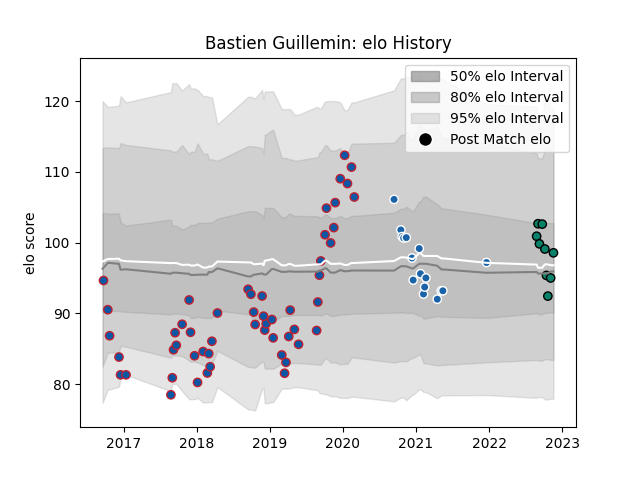

---  
layout: page  
title: Bastien Guillemin  
date: 2023-03-21 18:12:14.971524  
categories: player  
---
# Bastien Guillemin

Last updated: 2023-03-21
## Positions: W, FB

## Current elo: 107.0

## Current Percentile: 64.0

# Elo History

# Match History

| Team              |   Appearances |   Win Rate |
|:------------------|--------------:|-----------:|
| Grenoble          |            63 |   0.539683 |
| Castres Olympique |            17 |   0.352941 |
| Montauban         |            12 |   0.541667 |

| Opponent             |   Matches |   Win Rate |
|:---------------------|----------:|-----------:|
| Biarritz Olympique   |         5 |   0.5      |
| Aurillac             |         5 |   0.6      |
| Agen                 |         4 |   0.5      |
| Colomiers            |         4 |   0.5      |
| Racing 92            |         4 |   0.25     |
| Perpignan            |         4 |   0.25     |
| Montauban            |         4 |   0.75     |
| Lyon                 |         4 |   0.25     |
| Vannes               |         4 |   0.625    |
| Mont-de-Marsan       |         3 |   1        |
| Carcassonne          |         3 |   0.666667 |
| Toulon               |         3 |   0.333333 |
| Soyaux-Angouleme     |         3 |   1        |
| Bayonne              |         3 |   1        |
| Massy                |         3 |   0.666667 |
| Ospreys              |         3 |   0        |
| Newcastle Falcons    |         3 |   0.333333 |
| Clermont Auvergne    |         2 |   0        |
| Stade Francais Paris |         2 |   0.5      |
| Benetton Treviso     |         2 |   0        |
| Oyonnax              |         2 |   1        |
| Castres Olympique    |         2 |   0        |
| Munster              |         2 |   0        |
| Montpellier Herault  |         2 |   1        |
| Beziers              |         2 |   1        |
| Bordeaux Begles      |         2 |   0        |
| Harlequins           |         2 |   0.5      |
| Narbonne             |         1 |   0.5      |
| Brive                |         1 |   0        |
| Provence Rugby       |         1 |   1        |
| La Rochelle          |         1 |   0        |
| Rouen                |         1 |   0        |
| Roval Drome XV       |         1 |   1        |
| Grenoble             |         1 |   0        |
| Stade Toulousain     |         1 |   1        |
| Dax                  |         1 |   1        |
| Nevers               |         1 |   1        |