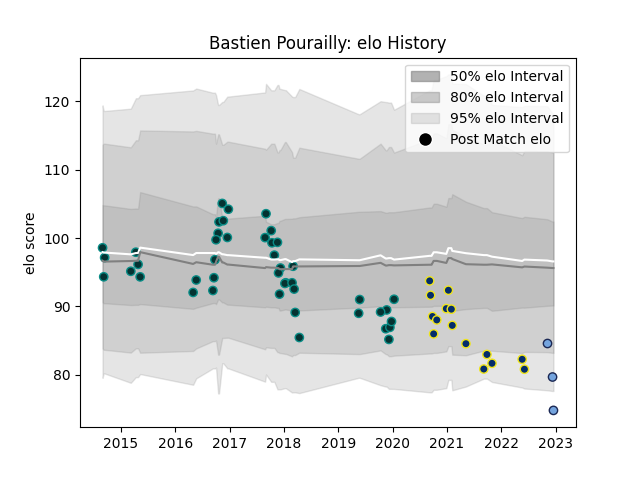

---  
layout: page  
title: Bastien Pourailly  
date: 2022-12-18 16:30:05.394775  
categories: player  
---
# Bastien Pourailly

## Positions: W

## Current elo: 75.0

## Current Percentile: 6.0

# Elo History

# Match History

| Team              |   Appearances |   Win Rate |
|:------------------|--------------:|-----------:|
| Pau               |            44 |   0.5      |
| Clermont Auvergne |            15 |   0.466667 |
| Bayonne           |             3 |   0.333333 |

| Opponent             |   Matches |   Win Rate |
|:---------------------|----------:|-----------:|
| Agen                 |         5 |   0.6      |
| Racing 92            |         5 |   0.4      |
| Bordeaux Begles      |         5 |   0.4      |
| Stade Toulousain     |         4 |   0.5      |
| Montpellier Herault  |         3 |   0.333333 |
| Cardiff Blues        |         3 |   0.333333 |
| Lyon                 |         3 |   0.333333 |
| Stade Francais Paris |         3 |   0.333333 |
| Pau                  |         2 |   1        |
| Calvisano            |         2 |   1        |
| Toulon               |         2 |   0        |
| Castres Olympique    |         2 |   0.5      |
| Clermont Auvergne    |         2 |   0.5      |
| Grenoble             |         2 |   1        |
| La Rochelle          |         2 |   0.5      |
| Aurillac             |         2 |   0.5      |
| Brive                |         2 |   0.5      |
| Scarlets             |         1 |   0        |
| Montauban            |         1 |   1        |
| Oyonnax              |         1 |   1        |
| Gloucester Rugby     |         1 |   1        |
| Leicester Tigers     |         1 |   0        |
| Albi                 |         1 |   0        |
| Bristol Rugby        |         1 |   0        |
| Biarritz Olympique   |         1 |   1        |
| Beziers              |         1 |   1        |
| Benetton Treviso     |         1 |   0        |
| Bayonne              |         1 |   0        |
| Bath Rugby           |         1 |   0        |
| Zebre                |         1 |   1        |