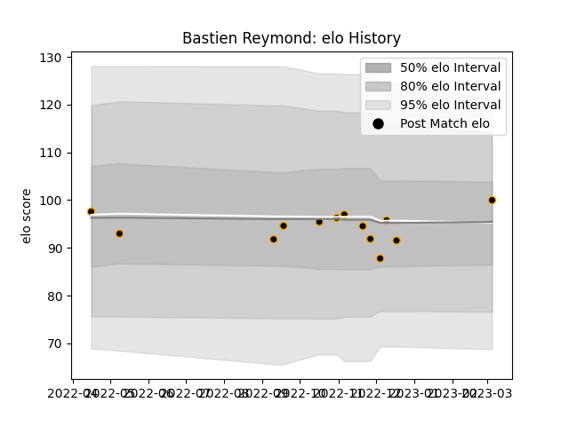

---  
layout: page  
title: Bastien Reymond  
date: 2022-12-09 13:08:36.035107  
categories: player  
---
# Bastien Reymond

## Positions: C

## Current elo: 92.0

## Current Percentile: 50.0

# Elo History

# Match History

| Team     |   Appearances |   Win Rate |
|:---------|--------------:|-----------:|
| Chambery |            10 |        0.3 |

| Opponent                   |   Matches |   Win Rate |
|:---------------------------|----------:|-----------:|
| Albi                       |         1 |          0 |
| Bourgoin-Jallieu           |         1 |          0 |
| Cognac Saint Jean d'Angély |         1 |          0 |
| Dax                        |         1 |          0 |
| Massy                      |         1 |          0 |
| Narbonne                   |         1 |          1 |
| Nice                       |         1 |          1 |
| Rennes                     |         1 |          1 |
| Suresnes                   |         1 |          0 |
| US Bressane                |         1 |          0 |