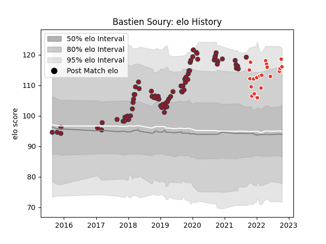

---  
layout: page  
title: Bastien Soury  
date: 2023-02-24 02:31:21.844524  
categories: player  
---
# Bastien Soury

## Positions: H

## Current elo: 116.0

## Current Percentile: 87.0

# Elo History

# Match History

| Team               |   Appearances |   Win Rate |
|:-------------------|--------------:|-----------:|
| Toulon             |            76 |   0.552632 |
| Biarritz Olympique |            21 |   0.309524 |

| Opponent             |   Matches |   Win Rate |
|:---------------------|----------:|-----------:|
| Montpellier Herault  |         8 |   0.375    |
| Agen                 |         7 |   0.571429 |
| Castres Olympique    |         7 |   0.428571 |
| Stade Francais Paris |         7 |   0.571429 |
| Brive                |         6 |   0.333333 |
| Bordeaux Begles      |         6 |   0.5      |
| La Rochelle          |         6 |   0.5      |
| Lyon                 |         6 |   0.166667 |
| Clermont Auvergne    |         5 |   0.4      |
| Pau                  |         5 |   0.6      |
| Racing 92            |         5 |   0.2      |
| Stade Toulousain     |         4 |   0.25     |
| Scarlets             |         3 |   1        |
| Bayonne              |         3 |   1        |
| Perpignan            |         3 |   0.666667 |
| Toulon               |         2 |   0.5      |
| London Irish         |         2 |   1        |
| Oyonnax              |         2 |   0.5      |
| Sale Sharks          |         1 |   1        |
| Montauban            |         1 |   1        |
| Newcastle Falcons    |         1 |   1        |
| Nevers               |         1 |   0.5      |
| Bath Rugby           |         1 |   1        |
| Leicester Tigers     |         1 |   1        |
| Edinburgh            |         1 |   0        |
| Carcassonne          |         1 |   1        |
| Bristol Rugby        |         1 |   0        |
| Wasps                |         1 |   0        |