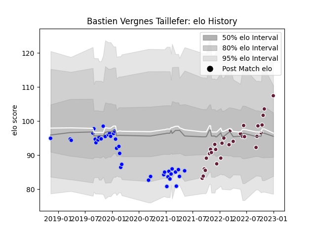

---  
layout: page  
title: Bastien Vergnes Taillefer  
date: 2023-01-06 00:21:17.728608  
categories: player  
---
# Bastien Vergnes Taillefer

## Positions: FL, N8

## Current elo: 112.0

## Current Percentile: 61.0

# Elo History

# Match History

| Team            |   Appearances |   Win Rate |
|:----------------|--------------:|-----------:|
| Colomiers       |            38 |   0.631579 |
| Bordeaux Begles |            29 |   0.586207 |

| Opponent                   |   Matches |   Win Rate |
|:---------------------------|----------:|-----------:|
| Perpignan                  |         5 |   0.4      |
| Biarritz Olympique         |         4 |   0.25     |
| Aurillac                   |         3 |   0.666667 |
| Lyon                       |         3 |   0.666667 |
| Rouen                      |         3 |   1        |
| Racing 92                  |         3 |   1        |
| Oyonnax                    |         3 |   0.666667 |
| Montpellier Herault        |         3 |   0.333333 |
| Vannes                     |         3 |   0.333333 |
| Clermont Auvergne          |         3 |   0.5      |
| Castres Olympique          |         3 |   0.833333 |
| La Rochelle                |         2 |   0        |
| Carcassonne                |         2 |   1        |
| Valence Romans Drome Rugby |         2 |   0.5      |
| Stade Toulousain           |         2 |   0.5      |
| Roval Drome XV             |         2 |   1        |
| Beziers                    |         2 |   1        |
| Brive                      |         2 |   1        |
| Provence Rugby             |         2 |   1        |
| Montauban                  |         2 |   0.5      |
| Mont-de-Marsan             |         2 |   0.5      |
| Grenoble                   |         2 |   0.5      |
| Nevers                     |         2 |   1        |
| Leicester Tigers           |         1 |   0        |
| Pau                        |         1 |   0        |
| Bayonne                    |         1 |   0        |
| Scarlets                   |         1 |   1        |
| Soyaux-Angouleme           |         1 |   0        |
| Stade Francais Paris       |         1 |   1        |
| Toulon                     |         1 |   1        |