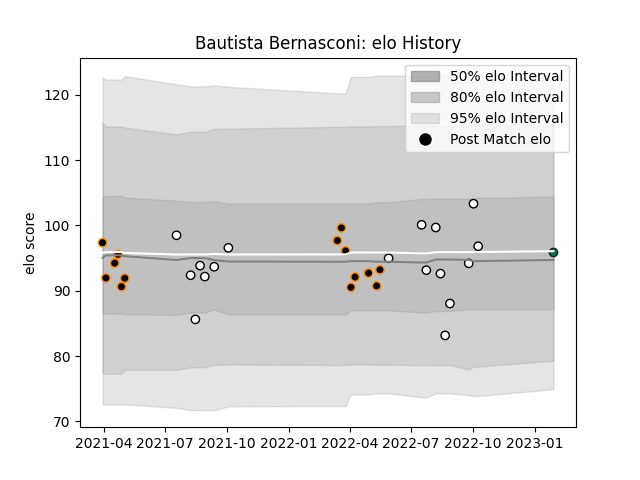

---  
layout: page  
title: Bautista Bernasconi  
date: 2023-01-30 11:48:25.695111  
categories: player  
---
# Bautista Bernasconi

## Positions: H

## Current elo: 96.0

## Current Percentile: 55.0

# Elo History

# Match History

| Team             |   Appearances |   Win Rate |
|:-----------------|--------------:|-----------:|
| CASI             |            17 |   0.382353 |
| Jaguares XV      |            14 |   0.785714 |
| Benetton Treviso |             1 |   0        |

| Opponent             |   Matches |   Win Rate |
|:---------------------|----------:|-----------:|
| Olimpia Lions        |         4 |        1   |
| Penarol Rugby        |         4 |        0.5 |
| Selknam              |         2 |        0.5 |
| Pucara               |         2 |        0   |
| Belgrano             |         2 |        0.5 |
| San Luis             |         2 |        0.5 |
| SIC                  |         2 |        0.5 |
| Cafeteros Pro        |         2 |        1   |
| Cobras               |         2 |        1   |
| Los Tilos            |         2 |        0.5 |
| Newman               |         2 |        0.5 |
| Regatas Bella Vista  |         1 |        1   |
| Alumni               |         1 |        0   |
| Atlético del Rosario |         1 |        0.5 |
| CUBA                 |         1 |        0   |
| Buenos Aires         |         1 |        0   |
| Munster              |         1 |        0   |