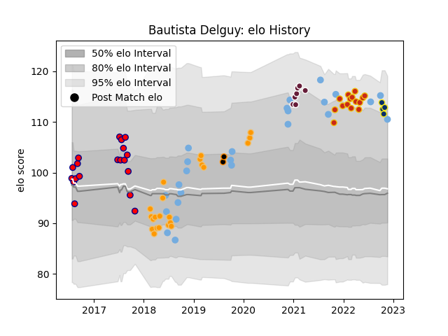

---  
layout: page  
title: Bautista Delguy  
date: 2023-02-02 18:57:37.173468  
categories: player  
---
# Bautista Delguy

## Positions: W, FB

## Country: Argentina

## Current elo: 102.0

## Current Percentile: 66.0

# Elo History

# Match History

| Team              |   Appearances |   Win Rate |
|:------------------|--------------:|-----------:|
| Argentina         |            25 |   0.34     |
| Jaguares          |            22 |   0.5      |
| Pucara            |            22 |   0.590909 |
| Perpignan         |            15 |   0.333333 |
| Clermont Auvergne |            11 |   0.227273 |
| Bordeaux Begles   |             7 |   0.642857 |
| Jaguares XV       |             3 |   1        |

| Opponent                 |   Matches |   Win Rate |
|:-------------------------|----------:|-----------:|
| Stormers                 |         5 |   0.2      |
| Lions                    |         5 |   0.4      |
| Australia                |         4 |   0.625    |
| Stade Toulousain         |         4 |   0.25     |
| South Africa             |         4 |   0.25     |
| Scotland                 |         4 |   0.25     |
| New Zealand              |         4 |   0.25     |
| Lyon                     |         3 |   0.333333 |
| Clermont Auvergne        |         3 |   0.5      |
| Racing 92                |         3 |   0.666667 |
| La Rochelle              |         3 |   0.333333 |
| La Plata                 |         3 |   0.666667 |
| Wales                    |         3 |   0.333333 |
| Belgrano                 |         3 |   0.666667 |
| Bordeaux Begles          |         3 |   0.5      |
| Castres Olympique        |         3 |   0        |
| Bulls                    |         3 |   0.666667 |
| Perpignan                |         2 |   1        |
| Montpellier Herault      |         2 |   0        |
| Blues                    |         2 |   1        |
| Sharks                   |         2 |   0.5      |
| Regatas Bella Vista      |         2 |   0.5      |
| Queensland Reds          |         2 |   0.5      |
| Newman                   |         2 |   0.5      |
| Alumni                   |         2 |   0.5      |
| CASI                     |         2 |   0.5      |
| Leicester Tigers         |         2 |   0        |
| CUBA                     |         2 |   0        |
| France                   |         2 |   0        |
| Atlético del Rosario     |         2 |   1        |
| Mariano Moreno           |         1 |   1        |
| Hurricanes               |         1 |   0        |
| Valke                    |         1 |   1        |
| United States of America |         1 |   1        |
| Toulon                   |         1 |   0        |
| Tonga                    |         1 |   1        |
| England                  |         1 |   0        |
| Stade Francais Paris     |         1 |   1        |
| Hindu                    |         1 |   0        |
| San Luis                 |         1 |   1        |
| Brive                    |         1 |   1        |
| SWD Eagles               |         1 |   1        |
| SIC                      |         1 |   1        |
| Ireland                  |         1 |   0        |
| Brumbies                 |         1 |   1        |
| Eastern Province Kings   |         1 |   1        |
| Pau                      |         1 |   0        |
| New South Wales Waratahs |         1 |   1        |
| Crusaders                |         1 |   0        |