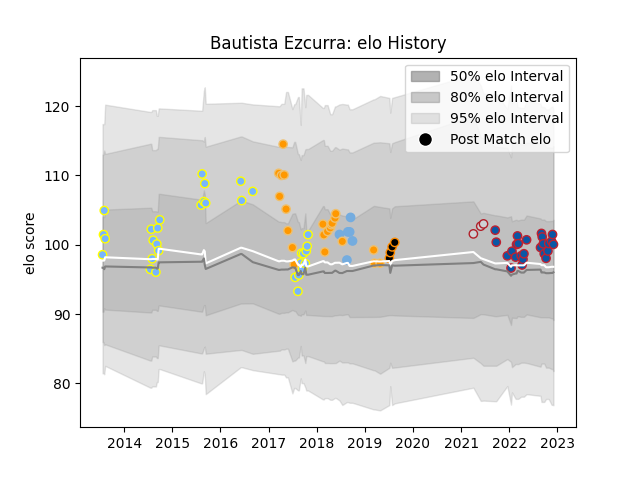

---  
layout: page  
title: Bautista Ezcurra  
date: 2023-03-17 17:35:57.906432  
categories: player  
---
# Bautista Ezcurra

## Positions: C, W

## Country: Argentina

## Current elo: 86.0

## Current Percentile: 23.0

# Elo History

# Match History

| Team        |   Appearances |   Win Rate |
|:------------|--------------:|-----------:|
| Hindu       |            40 |   0.8625   |
| Grenoble    |            29 |   0.551724 |
| Jaguares    |            22 |   0.454545 |
| Rugby ATL   |            19 |   0.631579 |
| Jaguares XV |             7 |   1        |
| Argentina   |             6 |   0.333333 |

| Opponent               |   Matches |   Win Rate |
|:-----------------------|----------:|-----------:|
| Belgrano               |         6 |   0.666667 |
| Lions                  |         4 |   0.25     |
| Alumni                 |         4 |   0.75     |
| Newman                 |         4 |   0.75     |
| Regatas Bella Vista    |         4 |   1        |
| SIC                    |         4 |   1        |
| Sharks                 |         4 |   0.25     |
| Brumbies               |         3 |   0.666667 |
| La Plata               |         3 |   0.833333 |
| R.U. New York          |         3 |   0.333333 |
| CUBA                   |         3 |   1        |
| Agen                   |         3 |   0.666667 |
| San Luis               |         3 |   1        |
| Aurillac               |         3 |   0.666667 |
| Rugby New York         |         3 |   0.333333 |
| South Africa           |         2 |   0.5      |
| Melbourne Rebels       |         2 |   1        |
| Stormers               |         2 |   0        |
| Toronto Arrows         |         2 |   1        |
| US Bressane            |         2 |   0.5      |
| Pucara                 |         2 |   1        |
| Oyonnax                |         2 |   0        |
| Old Glory DC           |         2 |   0.5      |
| Valke                  |         2 |   1        |
| New Zealand            |         2 |   0        |
| Nevers                 |         2 |   1        |
| NOLA Gold              |         2 |   1        |
| Vannes                 |         2 |   0        |
| Montauban              |         2 |   1        |
| CASI                   |         2 |   0.5      |
| Bayonne                |         2 |   0.5      |
| Lomas                  |         2 |   1        |
| Colomiers              |         2 |   0        |
| Griffons               |         2 |   1        |
| Beziers                |         2 |   0.5      |
| L. A. Giltinis         |         2 |   0.5      |
| Australia              |         1 |   1        |
| Utah Warriors          |         1 |   1        |
| San Diego Legion       |         1 |   1        |
| Soyaux-Angouleme       |         1 |   1        |
| Austin Gilgronis       |         1 |   0        |
| Southern Kings         |         1 |   0        |
| Biarritz Olympique     |         1 |   0.5      |
| Blues                  |         1 |   1        |
| Seattle Seawolves      |         1 |   1        |
| Scotland               |         1 |   0        |
| Atlético del Rosario   |         1 |   1        |
| Boland Cavaliers       |         1 |   1        |
| Massy                  |         1 |   1        |
| Bulls                  |         1 |   1        |
| Rouen                  |         1 |   1        |
| Carcassonne            |         1 |   1        |
| Cheetahs               |         1 |   1        |
| Queensland Reds        |         1 |   1        |
| Pueyrredón             |         1 |   1        |
| Provence Rugby         |         1 |   0        |
| Eastern Province Kings |         1 |   1        |
| Houston SaberCats      |         1 |   1        |
| Hurricanes             |         1 |   0        |
| Narbonne               |         1 |   0.5      |
| Leopards               |         1 |   1        |
| Liceo Naval            |         1 |   1        |
| Western Force          |         1 |   0        |