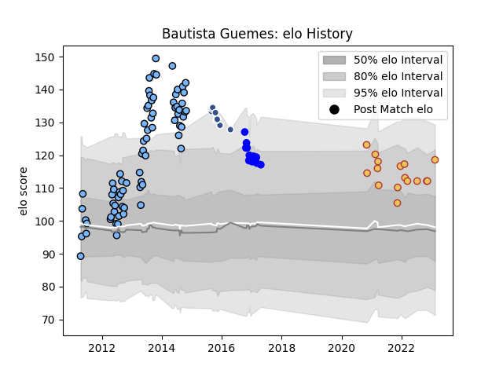

---  
layout: page  
title: Bautista Guemes  
date: 2023-02-15 22:12:31.856604  
categories: player  
---
# Bautista Guemes

## Positions: FH

## Country: Spain

## Current elo: 119.0

## Current Percentile: None

# Elo History

# Match History

| Team   |   Appearances |   Win Rate |
|:-------|--------------:|-----------:|
| CUBA   |            74 |   0.763514 |
| Spain  |            16 |   0.625    |
| Vannes |            13 |   0.230769 |
| Agen   |            10 |   0.2      |

| Opponent             |   Matches |   Win Rate |
|:---------------------|----------:|-----------:|
| Belgrano             |         7 |   0.642857 |
| Newman               |         6 |   0.666667 |
| Pucara               |         5 |   0.8      |
| Hindu                |         5 |   0.4      |
| La Plata             |         5 |   0.7      |
| Alumni               |         4 |   0.75     |
| Atlético del Rosario |         4 |   0.75     |
| SIC                  |         4 |   0.75     |
| San Luis             |         3 |   1        |
| Portugal             |         3 |   0.666667 |
| Liceo Naval          |         3 |   1        |
| Lomas                |         3 |   1        |
| CASI                 |         3 |   0.666667 |
| Pueyrredón           |         3 |   1        |
| Olivos               |         3 |   0.666667 |
| Los Tilos            |         2 |   0.5      |
| Mont-de-Marsan       |         2 |   0        |
| Uruguay              |         2 |   0.5      |
| Netherlands          |         2 |   1        |
| Regatas Bella Vista  |         2 |   1        |
| Russia               |         2 |   1        |
| San Martin           |         2 |   1        |
| Biarritz Olympique   |         2 |   0.5      |
| Racing 92            |         1 |   1        |
| Namibia              |         1 |   1        |
| San Albano           |         1 |   1        |
| San Andres           |         1 |   1        |
| Perpignan            |         1 |   0        |
| San Cirano           |         1 |   0.5      |
| Pau                  |         1 |   0        |
| Oyonnax              |         1 |   0        |
| Stade Francais Paris |         1 |   1        |
| Stade Toulousain     |         1 |   0        |
| Tonga                |         1 |   0        |
| Romania              |         1 |   0        |
| Agen                 |         1 |   0        |
| Montauban            |         1 |   0        |
| Curupaytí            |         1 |   1        |
| Beziers              |         1 |   1        |
| Bordeaux Begles      |         1 |   0        |
| Brive                |         1 |   0        |
| Buenos Aires         |         1 |   1        |
| Canada               |         1 |   1        |
| Carcassonne          |         1 |   0        |
| Champagnat           |         1 |   0        |
| Clermont Auvergne    |         1 |   0        |
| Colomiers            |         1 |   0        |
| Dax                  |         1 |   0        |
| Mariano Moreno       |         1 |   1        |
| Fiji                 |         1 |   0        |
| Georgia              |         1 |   0        |
| Germany              |         1 |   1        |
| Grenoble             |         1 |   0        |
| La Rochelle          |         1 |   0        |
| Liceo Militar        |         1 |   1        |
| London Irish         |         1 |   0        |
| Albi                 |         1 |   1        |
| Manuel Belgrano      |         1 |   1        |
| Los Matreros         |         1 |   1        |