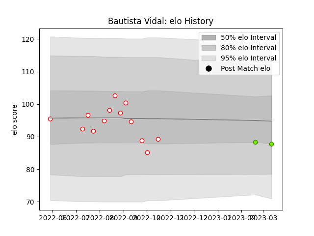

---  
layout: page  
title: Bautista Vidal  
date: 2023-03-12 11:30:13.402416  
categories: player  
---
# Bautista Vidal

## Positions: P

## Current elo: 88.0

## Current Percentile: 29.0

# Elo History

# Match History

| Team   |   Appearances |   Win Rate |
|:-------|--------------:|-----------:|
| Alumni |            13 |   0.576923 |
| Cobras |             2 |   0        |

| Opponent             |   Matches |   Win Rate |
|:---------------------|----------:|-----------:|
| Atlético del Rosario |         2 |       0.75 |
| Belgrano             |         1 |       1    |
| Buenos Aires         |         1 |       0    |
| CASI                 |         1 |       1    |
| CUBA                 |         1 |       1    |
| Hindu                |         1 |       0    |
| Los Tilos            |         1 |       1    |
| Newman               |         1 |       0    |
| Pampas XV            |         1 |       0    |
| Penarol Rugby        |         1 |       0    |
| Pucara               |         1 |       1    |
| Regatas Bella Vista  |         1 |       1    |
| SIC                  |         1 |       0    |
| San Luis             |         1 |       0    |