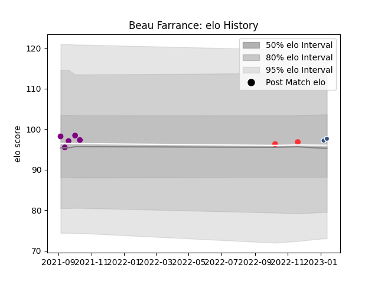

---  
layout: page  
title: Beau Farrance  
date: 2022-11-22 11:30:16.809690  
categories: player  
---
# Beau Farrance

## Positions: P

## Current elo: 98.0

## Current Percentile: None

# Elo History

# Match History

| Team             |   Appearances |   Win Rate |
|:-----------------|--------------:|-----------:|
| Tarbes           |             2 |        0.5 |
| Soyaux-Angouleme |             1 |        0   |

| Opponent            |   Matches |   Win Rate |
|:--------------------|----------:|-----------:|
| Albi                |         1 |          1 |
| Carqueiranne-Hyères |         1 |          0 |
| Tarbes              |         1 |          0 |