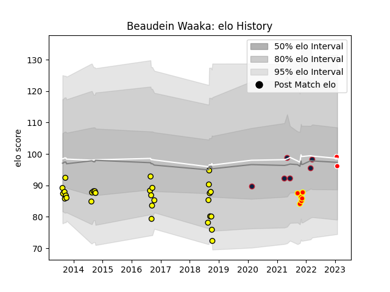

---  
layout: page  
title: Beaudein Waaka  
date: 2023-02-02 18:40:27.578650  
categories: player  
---
# Beaudein Waaka

## Positions: FB, W

## Current elo: 96.0

## Current Percentile: 46.0

# Elo History

# Match History

| Team                   |   Appearances |   Win Rate |
|:-----------------------|--------------:|-----------:|
| Taranaki               |            29 |   0.448276 |
| New England Free Jacks |             6 |   0.666667 |
| Waikato                |             6 |   0.666667 |
| Kobelco Kobe Steelers  |             2 |   0        |

| Opponent                          |   Matches |   Win Rate |
|:----------------------------------|----------:|-----------:|
| Tasman                            |         5 |   0.4      |
| Bay of Plenty                     |         4 |   0.75     |
| Canterbury                        |         4 |   0.25     |
| Counties Manukau                  |         4 |   0.625    |
| Auckland                          |         3 |   0.666667 |
| Wellington                        |         3 |   0.333333 |
| Hawke's Bay                       |         3 |   0.666667 |
| Manawatu                          |         2 |   0.5      |
| Austin Gilgronis                  |         2 |   1        |
| Utah Warriors                     |         2 |   0.5      |
| Waikato                           |         2 |   0.25     |
| Kubota Spears Funabashi Tokyo-Bay |         1 |   0        |
| L. A. Giltinis                    |         1 |   0        |
| North Harbour                     |         1 |   0        |
| Otago                             |         1 |   1        |
| Seattle Seawolves                 |         1 |   1        |
| Southland                         |         1 |   1        |
| Taranaki                          |         1 |   0        |
| Toyota Verblitz                   |         1 |   0        |
| Northland                         |         1 |   0        |