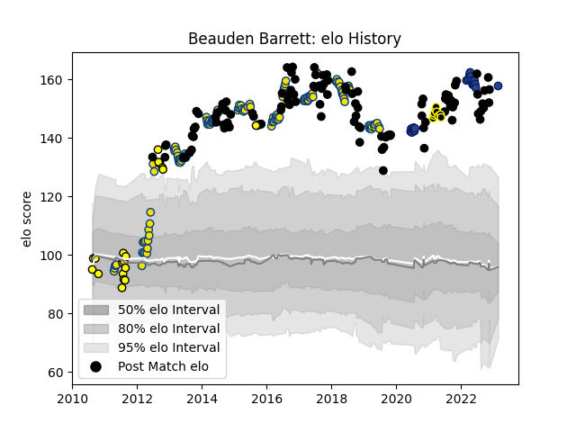

---  
layout: page  
title: Beauden Barrett  
date: 2023-03-21 18:48:42.692723  
categories: player  
---
# Beauden Barrett

Last updated: 2023-03-21
## Positions: FH, FB

## Country: New Zealand

## Current elo: 157.0

## Current Percentile: 100.0

# Elo History

# Match History

| Team             |   Appearances |   Win Rate |
|:-----------------|--------------:|-----------:|
| Hurricanes       |           126 |   0.646825 |
| New Zealand      |           116 |   0.853448 |
| Blues            |            22 |   0.772727 |
| Taranaki         |            18 |   0.666667 |
| Tokyo Sungoliath |             9 |   0.888889 |

| Opponent                          |   Matches |   Win Rate |
|:----------------------------------|----------:|-----------:|
| Australia                         |        28 |   0.875    |
| Highlanders                       |        22 |   0.636364 |
| Chiefs                            |        19 |   0.552632 |
| South Africa                      |        19 |   0.763158 |
| Crusaders                         |        18 |   0.444444 |
| Argentina                         |        17 |   0.941176 |
| Blues                             |        14 |   0.714286 |
| Brumbies                          |        11 |   0.545455 |
| Ireland                           |        10 |   0.5      |
| Wales                             |         9 |   1        |
| France                            |         8 |   1        |
| Queensland Reds                   |         8 |   0.875    |
| England                           |         7 |   0.785714 |
| New South Wales Waratahs          |         6 |   0.666667 |
| Lions                             |         6 |   0.833333 |
| Stormers                          |         6 |   0.5      |
| Sharks                            |         6 |   0.5      |
| Melbourne Rebels                  |         6 |   1        |
| Western Force                     |         6 |   1        |
| Cheetahs                          |         5 |   0.8      |
| Bulls                             |         5 |   0.6      |
| Tonga                             |         3 |   1        |
| British and Irish Lions           |         3 |   0.5      |
| Scotland                          |         3 |   1        |
| Canterbury                        |         3 |   0.333333 |
| Hurricanes                        |         3 |   0.666667 |
| Kubota Spears Funabashi Tokyo-Bay |         2 |   1        |
| Otago                             |         2 |   0.5      |
| Wellington                        |         2 |   0        |
| Bay of Plenty                     |         2 |   1        |
| Waikato                           |         2 |   1        |
| Sunwolves                         |         2 |   1        |
| Southern Kings                    |         2 |   1        |
| Italy                             |         2 |   1        |
| Fiji                              |         2 |   1        |
| Jaguares                          |         2 |   1        |
| Northland                         |         1 |   1        |
| Green Rockets Tokatsu             |         1 |   1        |
| Manawatu                          |         1 |   0        |
| Auckland                          |         1 |   1        |
| Mie Honda Heat                    |         1 |   1        |
| United States of America          |         1 |   1        |
| Toyota Verblitz                   |         1 |   1        |
| Toshiba Brave Lupus Tokyo         |         1 |   1        |
| Mitsubishi Dynaboars              |         1 |   1        |
| Tasman                            |         1 |   1        |
| Munakata Sanix Blues              |         1 |   1        |
| Fijian Drua                       |         1 |   1        |
| Southland                         |         1 |   1        |
| Namibia                           |         1 |   1        |
| Japan                             |         1 |   1        |
| Canada                            |         1 |   1        |
| North Harbour                     |         1 |   1        |
| Samoa                             |         1 |   1        |
| Saitama Wild Knights              |         1 |   0        |
| Hawke's Bay                       |         1 |   1        |