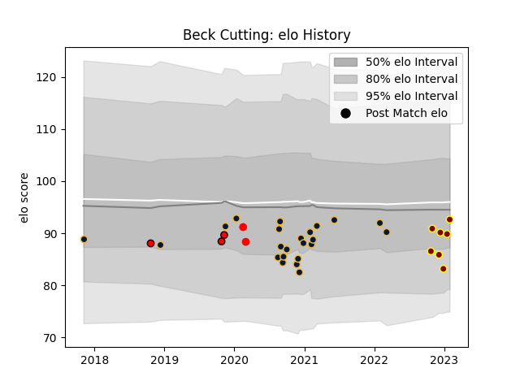

---  
layout: page  
title: Beck Cutting  
date: 2022-12-14 11:36:56.138276  
categories: player  
---
# Beck Cutting

## Positions: H

## Current elo: 94.0

## Current Percentile: 38.0

# Elo History

# Match History

| Team               |   Appearances |   Win Rate |
|:-------------------|--------------:|-----------:|
| Worcester Warriors |            23 |    0.26087 |
| Ampthill           |             4 |    0.375   |

| Opponent           |   Matches |   Win Rate |
|:-------------------|----------:|-----------:|
| London Irish       |         3 |   0.666667 |
| Bristol Rugby      |         2 |   0        |
| RC Enisei          |         2 |   1        |
| Pau                |         2 |   0        |
| Northampton Saints |         2 |   0        |
| Bath Rugby         |         2 |   0        |
| Exeter Chiefs      |         2 |   0        |
| Wasps              |         2 |   0        |
| Harlequins         |         1 |   1        |
| Hartpury College   |         1 |   0        |
| Leicester Tigers   |         1 |   0        |
| Gloucester Rugby   |         1 |   0        |
| Newcastle Falcons  |         1 |   0        |
| Doncaster          |         1 |   0        |
| Caldy              |         1 |   1        |
| Richmond           |         1 |   0.5      |
| Sale Sharks        |         1 |   0        |
| Saracens           |         1 |   1        |