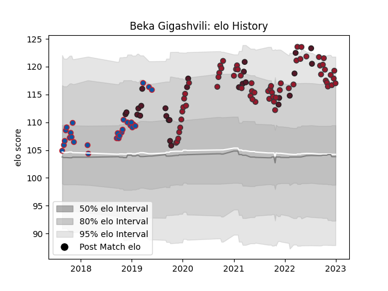

---  
layout: page  
title: Beka Gigashvili  
date: 2023-03-21 18:06:45.932979  
categories: player  
---
# Beka Gigashvili

Last updated: 2023-03-21
## Positions: P

## Country: Georgia

## Current elo: 110.0

## Current Percentile: 84.0

# Elo History

# Match History

| Team     |   Appearances |   Win Rate |
|:---------|--------------:|-----------:|
| Toulon   |            63 |   0.611111 |
| Grenoble |            29 |   0.465517 |
| Georgia  |            27 |   0.740741 |

| Opponent             |   Matches |   Win Rate |
|:---------------------|----------:|-----------:|
| Lyon                 |         7 |   0.428571 |
| Stade Toulousain     |         7 |   0.357143 |
| Castres Olympique    |         6 |   0.333333 |
| Bayonne              |         5 |   0.8      |
| Stade Francais Paris |         5 |   0.6      |
| Clermont Auvergne    |         5 |   0.7      |
| Bordeaux Begles      |         5 |   0.6      |
| Brive                |         5 |   0.6      |
| Racing 92            |         4 |   0.25     |
| Pau                  |         4 |   0.875    |
| Perpignan            |         4 |   0.25     |
| Romania              |         4 |   1        |
| Spain                |         4 |   1        |
| Montpellier Herault  |         4 |   0.375    |
| La Rochelle          |         3 |   0        |
| Russia               |         3 |   1        |
| Portugal             |         3 |   0.833333 |
| Scarlets             |         3 |   1        |
| Agen                 |         3 |   0.5      |
| Biarritz Olympique   |         3 |   1        |
| London Irish         |         2 |   1        |
| Montauban            |         2 |   0.5      |
| Fiji                 |         2 |   0.25     |
| Scotland             |         2 |   0        |
| Harlequins           |         2 |   0.5      |
| Italy                |         1 |   1        |
| Saracens             |         1 |   1        |
| Vannes               |         1 |   1        |
| Uruguay              |         1 |   1        |
| Toulon               |         1 |   0        |
| Tonga                |         1 |   1        |
| Bath Rugby           |         1 |   1        |
| Belgium              |         1 |   1        |
| Benetton Treviso     |         1 |   1        |
| Beziers              |         1 |   1        |
| Bristol Rugby        |         1 |   0        |
| Samoa                |         1 |   1        |
| Carcassonne          |         1 |   1        |
| Dax                  |         1 |   1        |
| France               |         1 |   0        |
| Nevers               |         1 |   0        |
| Narbonne             |         1 |   0.5      |
| Germany              |         1 |   1        |
| Mont-de-Marsan       |         1 |   1        |
| Australia            |         1 |   0        |
| Leicester Tigers     |         1 |   1        |
| Wales                |         1 |   0        |