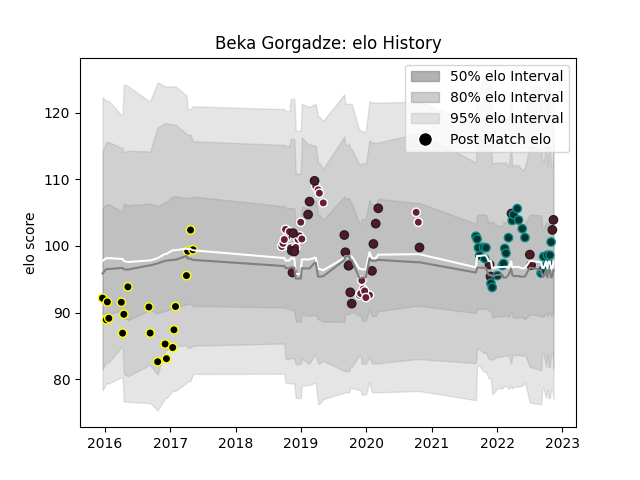

---  
layout: page  
title: Beka Gorgadze  
date: 2023-03-21 18:47:28.580823  
categories: player  
---
# Beka Gorgadze

Last updated: 2023-03-21
## Positions: N8, FL

## Country: Georgia

## Current elo: 124.0

## Current Percentile: 92.0

# Elo History

# Match History

| Team            |   Appearances |   Win Rate |
|:----------------|--------------:|-----------:|
| Georgia         |            32 |   0.609375 |
| Mont-de-Marsan  |            31 |   0.548387 |
| Pau             |            31 |   0.435484 |
| Bordeaux Begles |            25 |   0.58     |

| Opponent             |   Matches |   Win Rate |
|:---------------------|----------:|-----------:|
| Racing 92            |         6 |   0.333333 |
| Lyon                 |         6 |   0.333333 |
| Perpignan            |         5 |   0.8      |
| Castres Olympique    |         5 |   0.2      |
| Agen                 |         5 |   0.4      |
| Romania              |         4 |   0.75     |
| Clermont Auvergne    |         4 |   0.5      |
| La Rochelle          |         4 |   0.75     |
| Spain                |         3 |   1        |
| Scotland             |         3 |   0        |
| Italy                |         3 |   0.333333 |
| Stade Francais Paris |         3 |   0.333333 |
| Pau                  |         3 |   0.333333 |
| Narbonne             |         3 |   0.666667 |
| Stade Toulousain     |         3 |   0.666667 |
| Albi                 |         3 |   1        |
| Toulon               |         3 |   0.166667 |
| Montauban            |         3 |   0.666667 |
| Biarritz Olympique   |         3 |   0.333333 |
| Dax                  |         3 |   0.666667 |
| Aurillac             |         3 |   0.333333 |
| Brive                |         3 |   0.666667 |
| Russia               |         2 |   1        |
| Uruguay              |         2 |   1        |
| Montpellier Herault  |         2 |   0.5      |
| Belgium              |         2 |   1        |
| Samoa                |         2 |   0.5      |
| Wales                |         2 |   0.5      |
| Bourgoin-Jallieu     |         2 |   1        |
| Fiji                 |         2 |   0.25     |
| Provence Rugby       |         2 |   1        |
| Bordeaux Begles      |         2 |   0.5      |
| Germany              |         2 |   1        |
| Vannes               |         1 |   1        |
| Tarbes               |         1 |   1        |
| Bayonne              |         1 |   0        |
| Tonga                |         1 |   1        |
| Argentina            |         1 |   0        |
| Australia            |         1 |   0        |
| France               |         1 |   0        |
| Soyaux-Angouleme     |         1 |   0        |
| Sale Sharks          |         1 |   1        |
| Portugal             |         1 |   1        |
| Oyonnax              |         1 |   1        |
| Carcassonne          |         1 |   0        |
| Connacht             |         1 |   0        |
| Edinburgh            |         1 |   0.5      |
| Grenoble             |         1 |   0        |
| Wasps                |         1 |   1        |