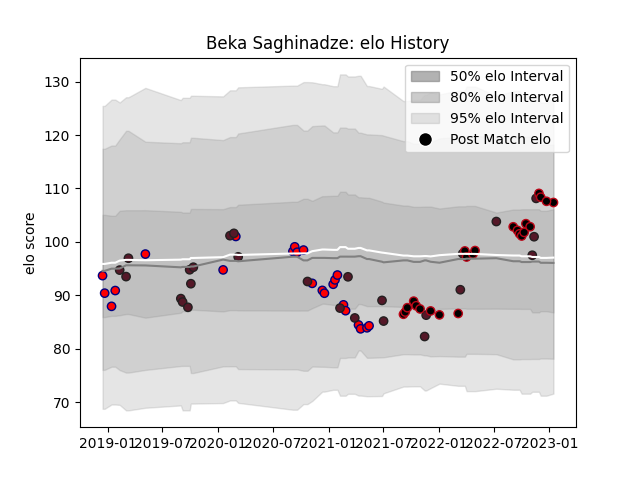

---  
layout: page  
title: Beka Saghinadze  
date: 2022-12-12 14:57:23.941298  
categories: player  
---
# Beka Saghinadze

## Positions: FL

## Country: Georgia

## Current elo: 107.0

## Current Percentile: 85.0

# Elo History

# Match History

| Team     |   Appearances |   Win Rate |
|:---------|--------------:|-----------:|
| Georgia  |            24 |   0.604167 |
| Lyon     |            22 |   0.590909 |
| Aurillac |            16 |   0.375    |

| Opponent                   |   Matches |   Win Rate |
|:---------------------------|----------:|-----------:|
| Romania                    |         3 |   1        |
| Perpignan                  |         3 |   0.333333 |
| Scotland                   |         3 |   0        |
| Brive                      |         3 |   1        |
| Clermont Auvergne          |         3 |   0.333333 |
| Montpellier Herault        |         3 |   0.666667 |
| Stade Toulousain           |         3 |   0.666667 |
| Wales                      |         2 |   0.5      |
| Portugal                   |         2 |   1        |
| Nevers                     |         2 |   0        |
| Soyaux-Angouleme           |         2 |   0.5      |
| Spain                      |         2 |   1        |
| Racing 92                  |         2 |   0.5      |
| Grenoble                   |         2 |   0.5      |
| Fiji                       |         2 |   0.25     |
| Colomiers                  |         2 |   0.5      |
| Uruguay                    |         2 |   1        |
| Toulon                     |         1 |   0        |
| South Africa               |         1 |   0        |
| Samoa                      |         1 |   0        |
| Valence Romans Drome Rugby |         1 |   1        |
| Vannes                     |         1 |   0        |
| Russia                     |         1 |   1        |
| Stade Francais Paris       |         1 |   1        |
| Australia                  |         1 |   0        |
| Provence Rugby             |         1 |   0        |
| Bayonne                    |         1 |   0        |
| Oyonnax                    |         1 |   1        |
| Netherlands                |         1 |   1        |
| Montauban                  |         1 |   0        |
| Mont-de-Marsan             |         1 |   0        |
| Italy                      |         1 |   1        |
| Germany                    |         1 |   1        |
| France                     |         1 |   0        |
| Bordeaux Begles            |         1 |   1        |
| Biarritz Olympique         |         1 |   1        |
| Beziers                    |         1 |   1        |
| Pau                        |         1 |   0        |