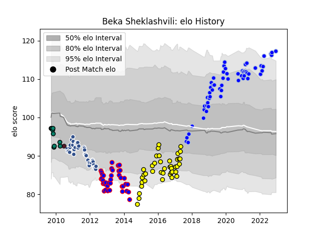

---  
layout: page  
title: Beka Sheklashvili  
date: 2022-12-18 16:24:10.203176  
categories: player  
---
# Beka Sheklashvili

## Positions: P

## Country: Georgia

## Current elo: 117.0

## Current Percentile: 96.0

# Elo History

# Match History

| Team      |   Appearances |   Win Rate |
|:----------|--------------:|-----------:|
| Colomiers |            58 |   0.706897 |
| Agen      |            44 |   0.397727 |
| Albi      |            41 |   0.487805 |
| Beziers   |            38 |   0.407895 |
| Montauban |             9 |   0.333333 |
| Georgia   |             1 |   0        |

| Opponent                   |   Matches |   Win Rate |
|:---------------------------|----------:|-----------:|
| Biarritz Olympique         |        12 |   0.625    |
| Carcassonne                |         9 |   0.555556 |
| Montauban                  |         9 |   0.555556 |
| Aurillac                   |         8 |   0.5      |
| Dax                        |         7 |   0.571429 |
| Narbonne                   |         7 |   0.642857 |
| Oyonnax                    |         7 |   0.285714 |
| Perpignan                  |         7 |   0.714286 |
| La Rochelle                |         7 |   0.428571 |
| Brive                      |         6 |   0.666667 |
| Lyon                       |         6 |   0.5      |
| Beziers                    |         6 |   0.333333 |
| Soyaux-Angouleme           |         6 |   0.5      |
| Tarbes                     |         6 |   0.666667 |
| Racing 92                  |         5 |   0.4      |
| Nevers                     |         5 |   0.8      |
| Mont-de-Marsan             |         5 |   0.4      |
| Massy                      |         5 |   0.8      |
| Vannes                     |         5 |   0.4      |
| Bayonne                    |         5 |   0.4      |
| Agen                       |         4 |   0.75     |
| Provence Rugby             |         4 |   0.75     |
| Stade Toulousain           |         4 |   0        |
| Colomiers                  |         4 |   0.25     |
| Clermont Auvergne          |         4 |   0.25     |
| Castres Olympique          |         4 |   0.5      |
| Albi                       |         4 |   0.75     |
| Rouen                      |         3 |   1        |
| Bourgoin-Jallieu           |         3 |   0.333333 |
| US Bressane                |         3 |   0.666667 |
| Pau                        |         3 |   0        |
| Montpellier Herault        |         3 |   0        |
| Toulon                     |         3 |   0.666667 |
| Sale Sharks                |         2 |   0        |
| Stade Francais Paris       |         2 |   0        |
| Grenoble                   |         2 |   1        |
| Auch                       |         2 |   0.5      |
| Valence Romans Drome Rugby |         1 |   1        |
| Italy A                    |         1 |   0        |
| Gloucester Rugby           |         1 |   0        |
| Bordeaux Begles            |         1 |   0        |