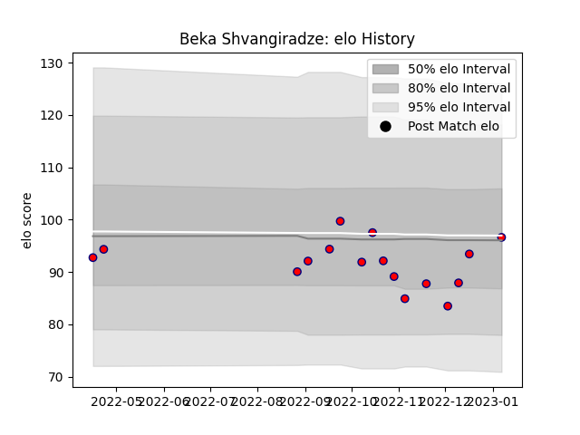

---  
layout: page  
title: Beka Shvangiradze  
date: 2023-01-13 11:30:54.959818  
categories: player  
---
# Beka Shvangiradze

## Positions: FL

## Current elo: 97.0

## Current Percentile: 44.0

# Elo History

# Match History

| Team     |   Appearances |   Win Rate |
|:---------|--------------:|-----------:|
| Aurillac |            16 |     0.5625 |

| Opponent           |   Matches |   Win Rate |
|:-------------------|----------:|-----------:|
| Carcassonne        |         2 |          0 |
| Mont-de-Marsan     |         2 |          0 |
| Montauban          |         2 |          1 |
| Agen               |         1 |          0 |
| Beziers            |         1 |          1 |
| Biarritz Olympique |         1 |          0 |
| Colomiers          |         1 |          1 |
| Grenoble           |         1 |          0 |
| Massy              |         1 |          1 |
| Nevers             |         1 |          1 |
| Provence Rugby     |         1 |          1 |
| Rouen              |         1 |          1 |
| Vannes             |         1 |          1 |