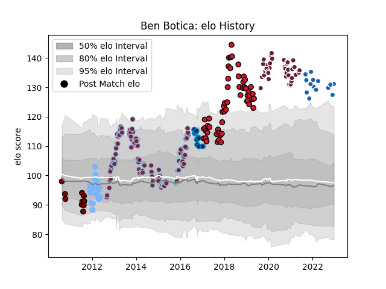

---  
layout: page  
title: Ben Botica  
date: 2022-12-18 16:19:10.840605  
categories: player  
---
# Ben Botica

## Positions: FH

## Current elo: 131.0

## Current Percentile: 97.0

# Elo History

# Match History

| Team                |   Appearances |   Win Rate |
|:--------------------|--------------:|-----------:|
| Harlequins          |           113 |   0.623894 |
| Oyonnax             |            55 |   0.536364 |
| Bordeaux Begles     |            43 |   0.697674 |
| Périgueux           |            18 |   0.333333 |
| Castres Olympique   |            15 |   0.3      |
| Montpellier Herault |            11 |   0.545455 |
| North Harbour       |            10 |   0.3      |

| Opponent             |   Matches |   Win Rate |
|:---------------------|----------:|-----------:|
| Northampton Saints   |        10 |   0.3      |
| Racing 92            |        10 |   0.5      |
| Wasps                |         9 |   0.666667 |
| London Irish         |         9 |   0.888889 |
| Bath Rugby           |         9 |   0.666667 |
| Clermont Auvergne    |         9 |   0.555556 |
| Sale Sharks          |         8 |   0.75     |
| Leicester Tigers     |         8 |   0.75     |
| Pau                  |         8 |   0.5      |
| Agen                 |         8 |   0.875    |
| Stade Francais Paris |         8 |   0.625    |
| Gloucester Rugby     |         8 |   0.4375   |
| Saracens             |         7 |   0.142857 |
| Exeter Chiefs        |         7 |   0.285714 |
| Brive                |         7 |   0.428571 |
| Montpellier Herault  |         7 |   0.428571 |
| Stade Toulousain     |         7 |   0.357143 |
| Lyon                 |         7 |   0.428571 |
| La Rochelle          |         7 |   0.5      |
| Castres Olympique    |         6 |   0.666667 |
| Toulon               |         6 |   0.333333 |
| Newcastle Falcons    |         5 |   0.6      |
| Mont-de-Marsan       |         5 |   0.4      |
| Worcester Warriors   |         5 |   0.8      |
| London Welsh         |         5 |   1        |
| Bordeaux Begles      |         5 |   0.5      |
| Edinburgh            |         4 |   0.625    |
| Aurillac             |         4 |   0.75     |
| Bayonne              |         4 |   0.75     |
| Vannes               |         3 |   0.333333 |
| Soyaux-Angouleme     |         3 |   1        |
| Biarritz Olympique   |         3 |   0.666667 |
| Cardiff Blues        |         3 |   0.666667 |
| Carcassonne          |         3 |   0.666667 |
| Provence Rugby       |         3 |   0.333333 |
| Calvisano            |         2 |   1        |
| Wellington           |         2 |   0        |
| Tarbes               |         2 |   0        |
| Scarlets             |         2 |   0.5      |
| Beziers              |         2 |   1        |
| Grenoble             |         2 |   0.5      |
| Otago                |         2 |   0.5      |
| Connacht             |         2 |   1        |
| Narbonne             |         2 |   0.5      |
| Dax                  |         2 |   1        |
| Albi                 |         2 |   1        |
| Colomiers            |         2 |   0.5      |
| Munster              |         2 |   0        |
| Zebre                |         2 |   1        |
| Perpignan            |         1 |   1        |
| Tasman               |         1 |   1        |
| Auch                 |         1 |   0        |
| Harlequins           |         1 |   0        |
| Auckland             |         1 |   0        |
| Hawke's Bay          |         1 |   0        |
| US Bressane          |         1 |   0        |
| Ospreys              |         1 |   1        |
| Counties Manukau     |         1 |   0        |
| Bourgoin-Jallieu     |         1 |   1        |
| Bay of Plenty        |         1 |   0        |
| Leinster             |         1 |   1        |
| Northland            |         1 |   1        |
| Nevers               |         1 |   1        |
| Oyonnax              |         1 |   0        |
| Massy                |         1 |   1        |
| Bristol Rugby        |         1 |   0        |