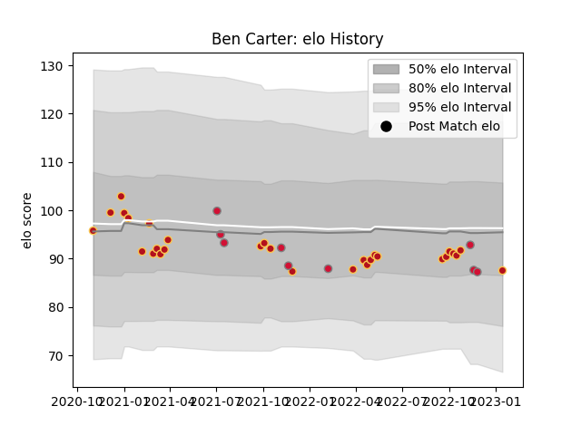

---  
layout: page  
title: Ben Carter  
date: 2022-11-22 11:30:18.089100  
categories: player  
---
# Ben Carter

## Positions: L

## Country: Wales

## Current elo: 93.0

## Current Percentile: 51.0

# Elo History

# Match History

| Team    |   Appearances |   Win Rate |
|:--------|--------------:|-----------:|
| Dragons |            28 |     0.25   |
| Wales   |             8 |     0.4375 |

| Opponent         |   Matches |   Win Rate |
|:-----------------|----------:|-----------:|
| Ospreys          |         5 |   0.4      |
| Argentina        |         3 |   0.5      |
| Scarlets         |         3 |   0.333333 |
| Cardiff Blues    |         3 |   0        |
| Edinburgh        |         3 |   0.333333 |
| Glasgow Warriors |         2 |   1        |
| Munster          |         2 |   0.5      |
| Leinster         |         2 |   0        |
| Zebre            |         2 |   0        |
| Georgia          |         1 |   0        |
| Australia        |         1 |   1        |
| Connacht         |         1 |   0        |
| Canada           |         1 |   1        |
| Bulls            |         1 |   0        |
| Benetton Treviso |         1 |   0        |
| Sharks           |         1 |   0        |
| South Africa     |         1 |   0        |
| Stormers         |         1 |   0        |
| Ulster           |         1 |   0        |
| Ireland          |         1 |   0        |