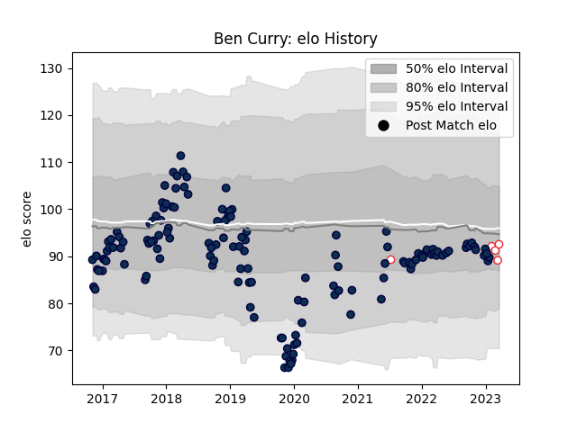

---  
layout: page  
title: Ben Curry  
date: 2023-03-17 17:33:31.311125  
categories: player  
---
# Ben Curry

## Positions: FL

## Country: England

## Current elo: 89.0

## Current Percentile: 43.0

# Elo History

# Match History

| Team        |   Appearances |   Win Rate |
|:------------|--------------:|-----------:|
| Sale Sharks |           139 |    0.52518 |
| England     |             4 |    0.5     |

| Opponent                 |   Matches |   Win Rate |
|:-------------------------|----------:|-----------:|
| Exeter Chiefs            |        13 |   0.153846 |
| Saracens                 |        12 |   0.25     |
| Bath Rugby               |        11 |   0.636364 |
| Wasps                    |        11 |   0.727273 |
| Harlequins               |        10 |   0.6      |
| Gloucester Rugby         |         9 |   0.666667 |
| Northampton Saints       |         9 |   0.777778 |
| Leicester Tigers         |         8 |   0.375    |
| Worcester Warriors       |         8 |   0.625    |
| Bristol Rugby            |         8 |   0.5625   |
| Newcastle Falcons        |         7 |   0.285714 |
| London Irish             |         7 |   0.857143 |
| Connacht                 |         3 |   0.666667 |
| Stade Toulousain         |         3 |   0.166667 |
| La Rochelle              |         3 |   0.333333 |
| Cardiff Blues            |         3 |   0.666667 |
| Ospreys                  |         2 |   1        |
| Perpignan                |         2 |   1        |
| Bordeaux Begles          |         2 |   0.5      |
| Scarlets                 |         2 |   1        |
| Lyon                     |         2 |   0.5      |
| Glasgow Warriors         |         2 |   0        |
| Scotland                 |         1 |   0        |
| Toulon                   |         1 |   0        |
| Ulster                   |         1 |   0        |
| United States of America |         1 |   1        |
| Wales                    |         1 |   1        |
| France                   |         1 |   0        |