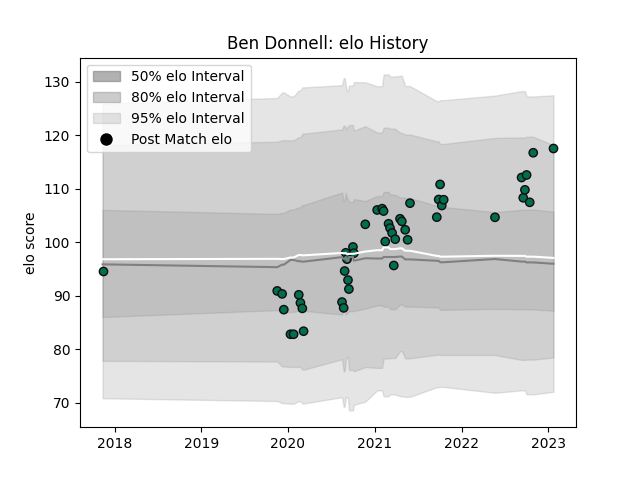

---  
layout: page  
title: Ben Donnell  
date: 2023-01-23 15:32:44.700650  
categories: player  
---
# Ben Donnell

## Positions: FL, L

## Current elo: 118.0

## Current Percentile: 89.0

# Elo History

# Match History

| Team         |   Appearances |   Win Rate |
|:-------------|--------------:|-----------:|
| London Irish |            47 |   0.276596 |

| Opponent            |   Matches |   Win Rate |
|:--------------------|----------:|-----------:|
| Gloucester Rugby    |         6 |   0.416667 |
| Harlequins          |         5 |   0.3      |
| Northampton Saints  |         5 |   0.2      |
| Worcester Warriors  |         5 |   0.4      |
| Bath Rugby          |         4 |   0.5      |
| Sale Sharks         |         4 |   0.125    |
| Exeter Chiefs       |         3 |   0.333333 |
| Leicester Tigers    |         3 |   0        |
| Bristol Rugby       |         2 |   0        |
| Newcastle Falcons   |         2 |   0.5      |
| Toulon              |         2 |   0        |
| Wasps               |         2 |   0.5      |
| Bayonne             |         1 |   0        |
| Montpellier Herault |         1 |   0.5      |
| Saracens            |         1 |   0        |
| Scarlets            |         1 |   0        |