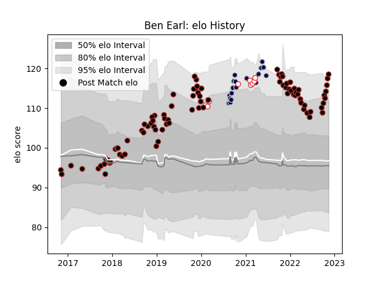

---  
layout: page  
title: Ben Earl  
date: 2023-01-06 00:10:47.344176  
categories: player  
---
# Ben Earl

## Positions: FL, N8

## Country: England

## Current elo: 122.0

## Current Percentile: 90.0

# Elo History

# Match History

| Team          |   Appearances |   Win Rate |
|:--------------|--------------:|-----------:|
| Saracens      |            93 |   0.736559 |
| Bristol Rugby |            19 |   0.736842 |
| England       |             9 |   0.666667 |

| Opponent           |   Matches |   Win Rate |
|:-------------------|----------:|-----------:|
| Exeter Chiefs      |        11 |   0.454545 |
| Harlequins         |         9 |   0.777778 |
| Bath Rugby         |         8 |   0.75     |
| Sale Sharks        |         8 |   0.625    |
| Northampton Saints |         8 |   0.875    |
| Newcastle Falcons  |         8 |   1        |
| Leicester Tigers   |         8 |   0.75     |
| Gloucester Rugby   |         8 |   0.75     |
| Worcester Warriors |         7 |   0.857143 |
| London Irish       |         6 |   0.583333 |
| Bristol Rugby      |         6 |   0.833333 |
| Wasps              |         4 |   0.5      |
| Lyon               |         3 |   1        |
| Scotland           |         2 |   0.5      |
| Dragons            |         2 |   1        |
| Ireland            |         2 |   0.5      |
| Italy              |         2 |   1        |
| Clermont Auvergne  |         2 |   0        |
| Munster            |         2 |   0.5      |
| Cardiff Blues      |         2 |   1        |
| Edinburgh          |         2 |   0.5      |
| Wales              |         2 |   0.5      |
| Racing 92          |         2 |   0.5      |
| Toulon             |         1 |   1        |
| France             |         1 |   1        |
| Scarlets           |         1 |   1        |
| Saracens           |         1 |   1        |
| Ospreys            |         1 |   1        |
| Bordeaux Begles    |         1 |   1        |
| Brive              |         1 |   1        |