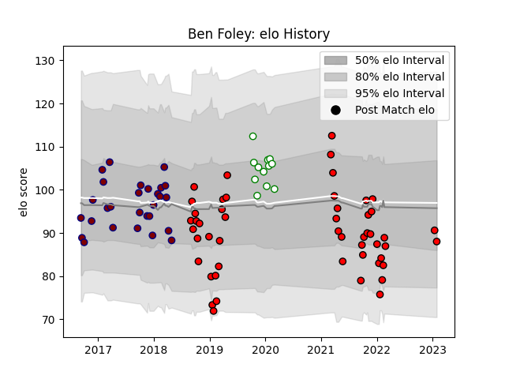

---  
layout: page  
title: Ben Foley  
date: 2023-01-21 15:43:48.713387  
categories: player  
---
# Ben Foley

## Positions: W, FB

## Current elo: 91.0

## Current Percentile: 23.0

# Elo History

# Match History

| Team             |   Appearances |   Win Rate |
|:-----------------|--------------:|-----------:|
| Hartpury College |            50 |   0.35     |
| Rotherham Titans |            28 |   0.125    |
| Nottingham       |            12 |   0.416667 |

| Opponent            |   Matches |   Win Rate |
|:--------------------|----------:|-----------:|
| Jersey              |        10 |   0.2      |
| Doncaster           |         9 |   0.111111 |
| Bedford             |         8 |   0.375    |
| Ealing Trailfinders |         8 |   0        |
| London Scottish     |         8 |   0.4375   |
| Nottingham          |         8 |   0.4375   |
| Cornish Pirates     |         7 |   0.285714 |
| Richmond            |         7 |   0.571429 |
| Coventry            |         6 |   0.333333 |
| Yorkshire Carnegie  |         6 |   0.333333 |
| Ampthill            |         4 |   0.5      |
| Hartpury College    |         4 |   0.25     |
| London Irish        |         3 |   0        |
| Bristol Rugby       |         1 |   0        |
| Newcastle Falcons   |         1 |   0        |