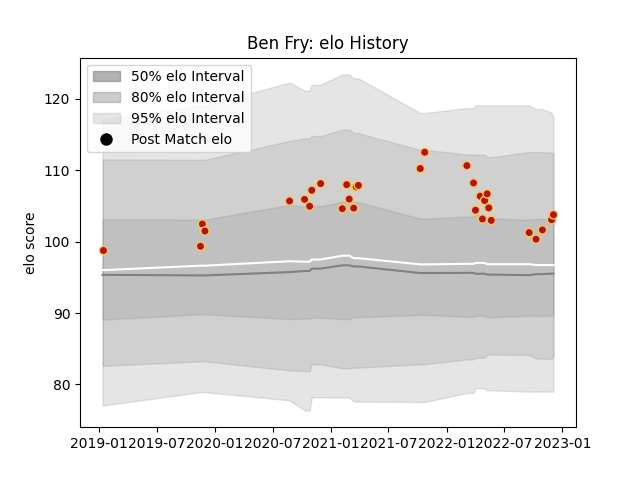

---  
layout: page  
title: Ben Fry  
date: 2023-01-06 00:19:32.821826  
categories: player  
---
# Ben Fry

## Positions: FL

## Current elo: 111.0

## Current Percentile: 72.0

# Elo History

# Match History

| Team    |   Appearances |   Win Rate |
|:--------|--------------:|-----------:|
| Dragons |            33 |   0.333333 |

| Opponent           |   Matches |   Win Rate |
|:-------------------|----------:|-----------:|
| Zebre              |         5 |   0.4      |
| Lions              |         3 |   0.166667 |
| Scarlets           |         3 |   0.333333 |
| Ulster             |         2 |   0        |
| Ospreys            |         2 |   0.25     |
| Benetton Treviso   |         2 |   0.5      |
| Edinburgh          |         2 |   0.5      |
| Connacht           |         2 |   0.5      |
| Cardiff Blues      |         2 |   0        |
| Munster            |         2 |   0        |
| Glasgow Warriors   |         1 |   1        |
| Leinster           |         1 |   0        |
| Bulls              |         1 |   0        |
| RC Enisei          |         1 |   1        |
| Castres Olympique  |         1 |   1        |
| Sharks             |         1 |   0        |
| Stormers           |         1 |   0        |
| Timisoara Saracens |         1 |   1        |