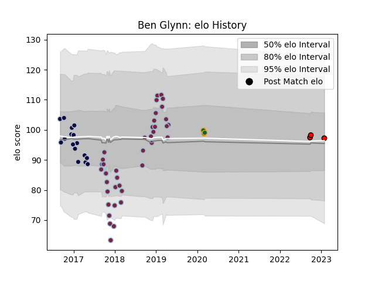

---  
layout: page  
title: Ben Glynn  
date: 2023-03-17 17:08:33.671565  
categories: player  
---
# Ben Glynn

## Positions: L, FL

## Current elo: 101.0

## Current Percentile: None

# Elo History

# Match History

| Team               |   Appearances |   Win Rate |
|:-------------------|--------------:|-----------:|
| Harlequins         |            39 |   0.487179 |
| Bristol Rugby      |            16 |   0.25     |
| Northampton Saints |             3 |   0.333333 |
| Hartpury College   |             2 |   0        |

| Opponent            |   Matches |   Win Rate |
|:--------------------|----------:|-----------:|
| Worcester Warriors  |         7 |   0.857143 |
| Wasps               |         6 |   0.5      |
| Northampton Saints  |         6 |   0.166667 |
| Newcastle Falcons   |         6 |   0.333333 |
| Exeter Chiefs       |         4 |   0.25     |
| Sale Sharks         |         4 |   0.5      |
| Bath Rugby          |         4 |   0.5      |
| Saracens            |         3 |   0.333333 |
| Harlequins          |         2 |   0        |
| La Rochelle         |         2 |   0        |
| Benetton Treviso    |         2 |   0.5      |
| Pau                 |         2 |   1        |
| Bristol Rugby       |         2 |   0.5      |
| Leicester Tigers    |         2 |   0        |
| Gloucester Rugby    |         1 |   1        |
| Grenoble            |         1 |   1        |
| London Irish        |         1 |   0        |
| Ealing Trailfinders |         1 |   0        |
| Clermont Auvergne   |         1 |   0        |
| Ospreys             |         1 |   0        |
| Richmond            |         1 |   0        |
| Cardiff Blues       |         1 |   0        |