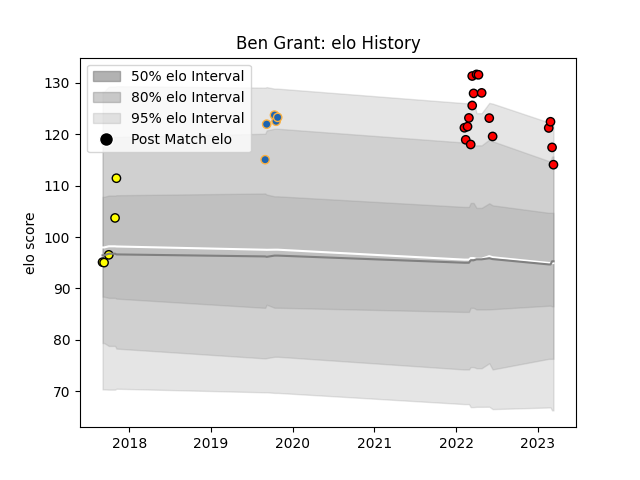

---  
layout: page  
title: Ben Grant  
date: 2023-03-17 17:40:00.971000  
categories: player  
---
# Ben Grant

## Positions: L

## Current elo: 114.0

## Current Percentile: 91.0

# Elo History

# Match History

| Team             |   Appearances |   Win Rate |
|:-----------------|--------------:|-----------:|
| San Diego Legion |            17 |   0.470588 |
| Perth Spirit     |             5 |   0.6      |
| Western Force    |             5 |   1        |

| Opponent               |   Matches |   Win Rate |
|:-----------------------|----------:|-----------:|
| Utah Warriors          |         3 |   1        |
| Canberra Vikings       |         3 |   0.333333 |
| Brisbane City          |         2 |   1        |
| Seattle Seawolves      |         2 |   0        |
| Queensland Country     |         2 |   1        |
| Austin Gilgronis       |         2 |   0        |
| Houston SaberCats      |         2 |   0.5      |
| Dallas Jackals         |         2 |   1        |
| L. A. Giltinis         |         1 |   0        |
| Melbourne Rising       |         1 |   1        |
| Old Glory DC           |         1 |   1        |
| Fijian Drua            |         1 |   1        |
| R.U. New York          |         1 |   0        |
| Rugby ATL              |         1 |   0        |
| Rugby New York         |         1 |   0        |
| Sydney Rays            |         1 |   1        |
| New England Free Jacks |         1 |   1        |