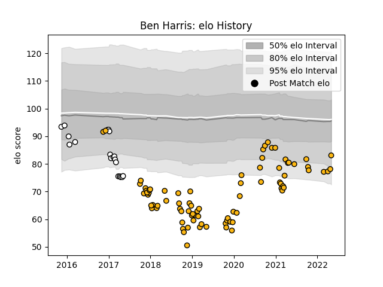

---  
layout: page  
title: Ben Harris  
date: 2023-02-02 19:00:12.203150  
categories: player  
---
# Ben Harris

## Positions: P

## Current elo: 83.0

## Current Percentile: 9.0

# Elo History

# Match History

| Team              |   Appearances |   Win Rate |
|:------------------|--------------:|-----------:|
| Wasps             |            81 |   0.450617 |
| Newcastle Falcons |            19 |   0.315789 |

| Opponent           |   Matches |   Win Rate |
|:-------------------|----------:|-----------:|
| Gloucester Rugby   |        10 |   0.45     |
| Bath Rugby         |         9 |   0.5      |
| Saracens           |         8 |   0.25     |
| Bristol Rugby      |         8 |   0.75     |
| Exeter Chiefs      |         7 |   0        |
| Worcester Warriors |         7 |   1        |
| Northampton Saints |         6 |   0.666667 |
| Sale Sharks        |         6 |   0.166667 |
| Harlequins         |         6 |   0.166667 |
| Leicester Tigers   |         6 |   0.333333 |
| London Irish       |         6 |   0.583333 |
| Newcastle Falcons  |         6 |   0.666667 |
| Stade Toulousain   |         2 |   0        |
| Brive              |         2 |   0.5      |
| Leinster           |         2 |   0        |
| La Rochelle        |         2 |   0.5      |
| Ospreys            |         1 |   0        |
| RC Enisei          |         1 |   0        |
| Grenoble           |         1 |   0        |
| Connacht           |         1 |   0        |
| Ulster             |         1 |   1        |
| Wasps              |         1 |   0        |
| Edinburgh          |         1 |   0        |