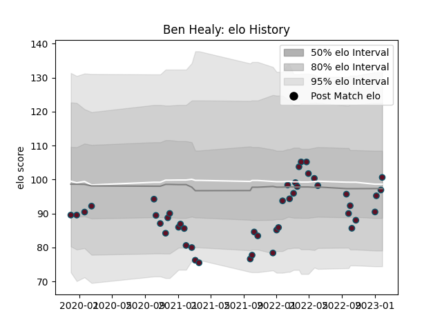

---  
layout: page  
title: Ben Healy  
date: 2023-01-06 00:14:15.515666  
categories: player  
---
# Ben Healy

## Positions: FH

## Current elo: 92.0

## Current Percentile: 8.0

# Elo History

# Match History

| Team    |   Appearances |   Win Rate |
|:--------|--------------:|-----------:|
| Munster |            42 |   0.642857 |

| Opponent          |   Matches |   Win Rate |
|:------------------|----------:|-----------:|
| Ulster            |         5 |   0.6      |
| Connacht          |         5 |   0.6      |
| Leinster          |         4 |   0        |
| Edinburgh         |         4 |   0.75     |
| Benetton Treviso  |         3 |   1        |
| Cardiff Blues     |         3 |   0.666667 |
| Ospreys           |         3 |   0.666667 |
| Scarlets          |         2 |   1        |
| Zebre             |         2 |   1        |
| Glasgow Warriors  |         2 |   0.5      |
| Dragons           |         2 |   0.5      |
| Bulls             |         1 |   0        |
| Sharks            |         1 |   1        |
| Southern Kings    |         1 |   1        |
| Stormers          |         1 |   1        |
| Castres Olympique |         1 |   1        |
| Wasps             |         1 |   1        |
| Lions             |         1 |   0        |