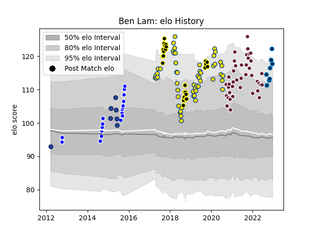

---  
layout: page  
title: Ben Lam  
date: 2022-12-18 16:33:41.639600  
categories: player  
---
# Ben Lam

## Positions: W

## Current elo: 118.0

## Current Percentile: 96.0

# Elo History

# Match History

| Team                |   Appearances |   Win Rate |
|:--------------------|--------------:|-----------:|
| Hurricanes          |            52 |   0.730769 |
| Bordeaux Begles     |            42 |   0.619048 |
| Wellington          |            25 |   0.76     |
| Auckland            |            20 |   0.75     |
| Montpellier Herault |             8 |   0.625    |
| Blues               |             7 |   0.142857 |

| Opponent                 |   Matches |   Win Rate |
|:-------------------------|----------:|-----------:|
| Crusaders                |        10 |   0.3      |
| Blues                    |         8 |   0.75     |
| Chiefs                   |         6 |   0.666667 |
| Highlanders              |         6 |   0.666667 |
| Tasman                   |         6 |   0.416667 |
| Stormers                 |         5 |   0.4      |
| La Rochelle              |         5 |   0        |
| Racing 92                |         5 |   0.6      |
| Stade Francais Paris     |         5 |   0.8      |
| Canterbury               |         5 |   0.4      |
| Montpellier Herault      |         4 |   0.75     |
| Lyon                     |         4 |   0.75     |
| Clermont Auvergne        |         4 |   0.875    |
| Manawatu                 |         4 |   1        |
| Toulon                   |         4 |   0.5      |
| Bulls                    |         4 |   0.75     |
| Northland                |         4 |   1        |
| Otago                    |         4 |   1        |
| North Harbour            |         3 |   1        |
| Brumbies                 |         3 |   0.666667 |
| Waikato                  |         3 |   1        |
| Taranaki                 |         3 |   0.666667 |
| Jaguares                 |         3 |   0.666667 |
| Sunwolves                |         3 |   1        |
| Auckland                 |         3 |   0.333333 |
| Bay of Plenty            |         3 |   1        |
| Sharks                   |         3 |   1        |
| Southland                |         2 |   0.75     |
| Pau                      |         2 |   1        |
| Lions                    |         2 |   1        |
| Stade Toulousain         |         2 |   0.5      |
| Counties Manukau         |         2 |   1        |
| Castres Olympique        |         2 |   0.75     |
| Brive                    |         2 |   0.5      |
| Biarritz Olympique       |         2 |   0.5      |
| Bayonne                  |         2 |   1        |
| Hawke's Bay              |         2 |   0.5      |
| Wellington               |         1 |   1        |
| Agen                     |         1 |   1        |
| Queensland Reds          |         1 |   1        |
| Ospreys                  |         1 |   0        |
| New South Wales Waratahs |         1 |   1        |
| Melbourne Rebels         |         1 |   1        |
| London Irish             |         1 |   1        |
| Leicester Tigers         |         1 |   0        |
| Hurricanes               |         1 |   0        |
| Edinburgh                |         1 |   1        |
| Cheetahs                 |         1 |   1        |
| Bristol Rugby            |         1 |   0        |
| Bordeaux Begles          |         1 |   1        |
| Western Force            |         1 |   1        |