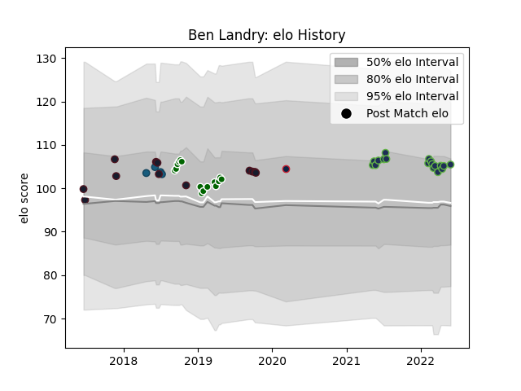

---  
layout: page  
title: Ben Landry  
date: 2023-02-28 11:07:37.078928  
categories: player  
---
# Ben Landry

## Positions: FL, L

## Country: United States of America

## Current elo: 105.0

## Current Percentile: 72.0

# Elo History

# Match History

| Team                     |   Appearances |   Win Rate |
|:-------------------------|--------------:|-----------:|
| Seattle Seawolves        |            18 |   0.5      |
| Ealing Trailfinders      |            15 |   0.866667 |
| United States of America |            12 |   0.458333 |
| Glendale Raptors         |             4 |   0.75     |
| New England Free Jacks   |             1 |   0        |

| Opponent               |   Matches |   Win Rate |
|:-----------------------|----------:|-----------:|
| Utah Warriors          |         4 |   0.75     |
| San Diego Legion       |         4 |   0.75     |
| NOLA Gold              |         4 |   0.5      |
| Canada                 |         3 |   0.833333 |
| Houston SaberCats      |         3 |   0.666667 |
| London Scottish        |         2 |   1        |
| Georgia                |         2 |   0        |
| Yorkshire Carnegie     |         2 |   1        |
| Bedford                |         2 |   0.5      |
| Cornish Pirates        |         2 |   1        |
| England                |         1 |   0        |
| Old Glory DC           |         1 |   0        |
| Austin Gilgronis       |         1 |   0        |
| Toronto Arrows         |         1 |   1        |
| Tonga                  |         1 |   0        |
| Seattle Seawolves      |         1 |   0        |
| Scotland               |         1 |   1        |
| Russia                 |         1 |   1        |
| Rugby ATL              |         1 |   0        |
| Richmond               |         1 |   1        |
| Nottingham             |         1 |   1        |
| Doncaster              |         1 |   1        |
| New Zealand Maori      |         1 |   0        |
| New England Free Jacks |         1 |   0        |
| Austin Elite Rugby     |         1 |   1        |
| London Irish           |         1 |   0        |
| L. A. Giltinis         |         1 |   0        |
| Jersey                 |         1 |   1        |
| Coventry               |         1 |   1        |
| Hartpury College       |         1 |   1        |
| Germany                |         1 |   1        |
| Argentina              |         1 |   0        |