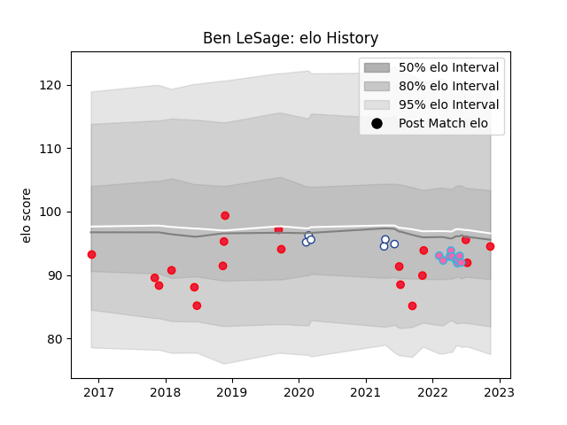

---  
layout: page  
title: Ben LeSage  
date: 2022-11-15 23:40:26.747870  
categories: player  
---
# Ben LeSage

## Positions: C

## Country: Canada

## Current elo: 94.0

## Current Percentile: 36.0

# Elo History

# Match History

| Team           |   Appearances |   Win Rate |
|:---------------|--------------:|-----------:|
| Canada         |            19 |   0.315789 |
| L. A. Giltinis |            10 |   0.7      |
| Toronto Arrows |             6 |   0.5      |

| Opponent                 |   Matches |   Win Rate |
|:-------------------------|----------:|-----------:|
| United States of America |         3 |   0        |
| Seattle Seawolves        |         3 |   0.666667 |
| Belgium                  |         2 |   1        |
| Dallas Jackals           |         2 |   1        |
| Houston SaberCats        |         2 |   0.5      |
| San Diego Legion         |         2 |   0        |
| Austin Gilgronis         |         1 |   1        |
| New Zealand Maori        |         1 |   0        |
| Utah Warriors            |         1 |   1        |
| Uruguay                  |         1 |   0        |
| Spain                    |         1 |   0        |
| Scotland                 |         1 |   0        |
| Romania                  |         1 |   0        |
| R.U. New York            |         1 |   1        |
| Portugal                 |         1 |   0        |
| Netherlands              |         1 |   1        |
| New England Free Jacks   |         1 |   1        |
| Austin Herd              |         1 |   1        |
| L. A. Giltinis           |         1 |   0        |
| Kenya                    |         1 |   1        |
| Italy                    |         1 |   0        |
| Hong Kong                |         1 |   1        |
| Germany                  |         1 |   1        |
| Fiji                     |         1 |   0        |
| England                  |         1 |   0        |
| Colorado Raptors         |         1 |   0        |
| Wales                    |         1 |   0        |