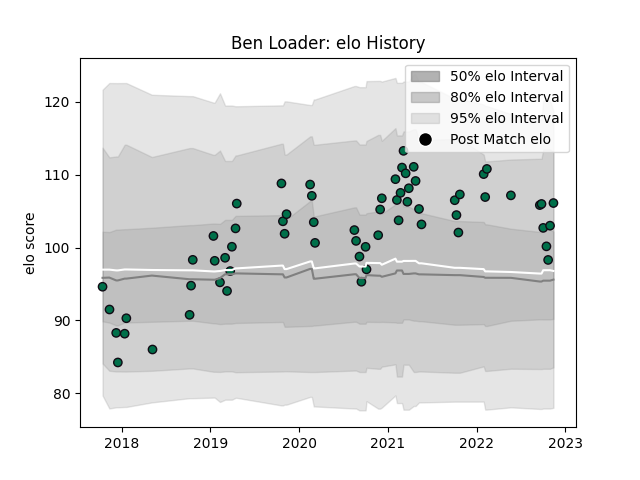

---  
layout: page  
title: Ben Loader  
date: 2022-12-09 13:19:20.617633  
categories: player  
---
# Ben Loader

## Positions: W

## Current elo: 112.0

## Current Percentile: 85.0

# Elo History

# Match History

| Team         |   Appearances |   Win Rate |
|:-------------|--------------:|-----------:|
| London Irish |            66 |   0.454545 |

| Opponent             |   Matches |   Win Rate |
|:---------------------|----------:|-----------:|
| Gloucester Rugby     |         7 |   0.357143 |
| Exeter Chiefs        |         6 |   0.5      |
| Bath Rugby           |         5 |   0.4      |
| Sale Sharks          |         5 |   0        |
| Leicester Tigers     |         5 |   0.4      |
| Northampton Saints   |         4 |   0        |
| Bristol Rugby        |         4 |   0.375    |
| Newcastle Falcons    |         3 |   0.666667 |
| Worcester Warriors   |         3 |   0.333333 |
| Harlequins           |         3 |   0.333333 |
| Wasps                |         3 |   0.666667 |
| Richmond             |         2 |   1        |
| Doncaster            |         2 |   1        |
| Edinburgh            |         2 |   0        |
| London Scottish      |         2 |   1        |
| Krasny Yar           |         2 |   1        |
| Yorkshire Carnegie   |         2 |   0.5      |
| Nottingham           |         1 |   1        |
| Bedford              |         1 |   1        |
| Saracens             |         1 |   0        |
| Stade Francais Paris |         1 |   0        |
| Hartpury College     |         1 |   1        |
| Cornish Pirates      |         1 |   1        |