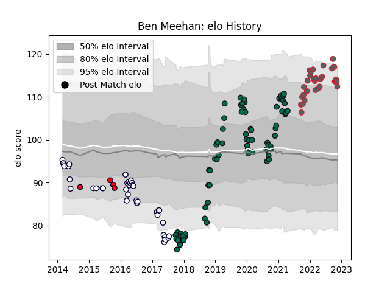

---  
layout: page  
title: Ben Meehan  
date: 2022-12-18 16:39:20.333776  
categories: player  
---
# Ben Meehan

## Positions: SH

## Current elo: 112.0

## Current Percentile: 93.0

# Elo History

# Match History

| Team             |   Appearances |   Win Rate |
|:-----------------|--------------:|-----------:|
| London Irish     |            72 |   0.479167 |
| Melbourne Rebels |            38 |   0.263158 |
| Gloucester Rugby |            30 |   0.516667 |
| Melbourne Rising |            13 |   0.615385 |

| Opponent                 |   Matches |   Win Rate |
|:-------------------------|----------:|-----------:|
| Leicester Tigers         |         7 |   0.285714 |
| Wasps                    |         7 |   0.571429 |
| Bath Rugby               |         7 |   0.571429 |
| Sale Sharks              |         7 |   0.142857 |
| Worcester Warriors       |         6 |   0.333333 |
| Bristol Rugby            |         6 |   0.5      |
| Exeter Chiefs            |         6 |   0.333333 |
| New South Wales Waratahs |         6 |   0.166667 |
| Newcastle Falcons        |         5 |   0.4      |
| Saracens                 |         5 |   0.4      |
| Harlequins               |         5 |   0.3      |
| Western Force            |         5 |   0.4      |
| Gloucester Rugby         |         5 |   0.4      |
| Northampton Saints       |         5 |   0.4      |
| Hurricanes               |         4 |   0        |
| Queensland Reds          |         4 |   0.75     |
| Crusaders                |         3 |   0        |
| Brumbies                 |         3 |   0        |
| NSW Country Eagles       |         3 |   0.666667 |
| Krasny Yar               |         2 |   1        |
| Nottingham               |         2 |   1        |
| Queensland Country       |         2 |   1        |
| Richmond                 |         2 |   1        |
| London Irish             |         2 |   0.75     |
| Bayonne                  |         2 |   0.5      |
| Blues                    |         2 |   0        |
| Jersey                   |         2 |   0.5      |
| Toulon                   |         2 |   0        |
| Bulls                    |         2 |   0.5      |
| Canberra Vikings         |         2 |   0        |
| Cheetahs                 |         2 |   1        |
| Chiefs                   |         2 |   0        |
| Cornish Pirates          |         2 |   1        |
| Doncaster                |         2 |   1        |
| Edinburgh                |         2 |   0        |
| Bedford                  |         2 |   1        |
| Brisbane City            |         2 |   0.5      |
| Hartpury College         |         2 |   1        |
| Stade Francais Paris     |         1 |   1        |
| Stormers                 |         1 |   0        |
| Scarlets                 |         1 |   0        |
| Sunwolves                |         1 |   1        |
| Sydney Stars             |         1 |   1        |
| Agen                     |         1 |   1        |
| Perth Spirit             |         1 |   0        |
| North Harbour Rays       |         1 |   1        |
| London Scottish          |         1 |   1        |
| Lions                    |         1 |   0        |
| Leinster                 |         1 |   0        |
| Jaguares                 |         1 |   0        |
| Highlanders              |         1 |   0        |
| Greater Sydney Rams      |         1 |   1        |
| Ealing Trailfinders      |         1 |   1        |
| Yorkshire Carnegie       |         1 |   1        |