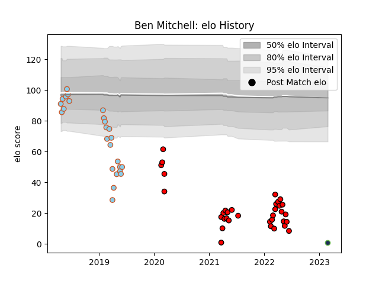

---  
layout: page  
title: Ben Mitchell  
date: 2023-02-28 11:03:16.451322  
categories: player  
---
# Ben Mitchell

## Positions: L

## Current elo: 1.0

## Current Percentile: 0.0

# Elo History

# Match History

| Team               |   Appearances |   Win Rate |
|:-------------------|--------------:|-----------:|
| San Diego Legion   |            34 |   0.470588 |
| Austin Elite Rugby |            25 |   0.12     |
| Seattle Seawolves  |             1 |   1        |

| Opponent               |   Matches |   Win Rate |
|:-----------------------|----------:|-----------:|
| Houston SaberCats      |         7 |   0.285714 |
| Seattle Seawolves      |         7 |   0        |
| Utah Warriors          |         7 |   0.571429 |
| NOLA Gold              |         5 |   0.6      |
| R.U. New York          |         5 |   0.2      |
| Rugby New York         |         5 |   0.2      |
| San Diego Legion       |         4 |   0.25     |
| Austin Gilgronis       |         3 |   0.333333 |
| Glendale Raptors       |         3 |   0        |
| L. A. Giltinis         |         3 |   0.333333 |
| Rugby ATL              |         3 |   0.333333 |
| Dallas Jackals         |         2 |   1        |
| New England Free Jacks |         2 |   0.5      |
| Old Glory DC           |         2 |   0.5      |
| Colorado Raptors       |         1 |   1        |
| Toronto Arrows         |         1 |   0        |