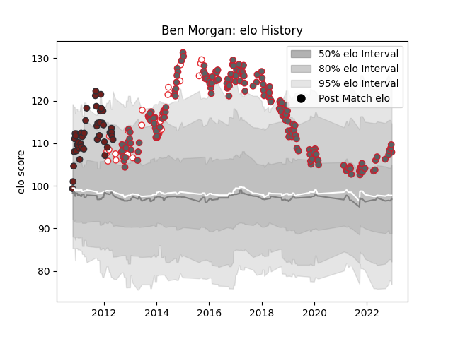

---  
layout: page  
title: Ben Morgan  
date: 2022-12-09 13:11:20.905934  
categories: player  
---
# Ben Morgan

## Positions: N8

## Country: England

## Current elo: 110.0

## Current Percentile: 83.0

# Elo History

# Match History

| Team             |   Appearances |   Win Rate |
|:-----------------|--------------:|-----------:|
| Gloucester Rugby |           174 |   0.502874 |
| Scarlets         |            45 |   0.566667 |
| England          |            25 |   0.68     |

| Opponent             |   Matches |   Win Rate |
|:---------------------|----------:|-----------:|
| Exeter Chiefs        |        20 |  0.475     |
| Northampton Saints   |        16 |  0.375     |
| Saracens             |        14 |  0.285714  |
| Leicester Tigers     |        13 |  0.230769  |
| Sale Sharks          |        12 |  0.5       |
| Wasps                |        11 |  0.545455  |
| Harlequins           |        11 |  0.272727  |
| London Irish         |        10 |  0.75      |
| Newcastle Falcons    |        10 |  0.7       |
| Worcester Warriors   |        10 |  0.7       |
| Bath Rugby           |        10 |  0.55      |
| Munster              |         9 |  0.0555556 |
| Bristol Rugby        |         9 |  0.444444  |
| Cardiff Blues        |         6 |  0.833333  |
| Connacht             |         5 |  0.4       |
| Edinburgh            |         5 |  0.8       |
| Benetton Treviso     |         5 |  0.8       |
| Leinster             |         4 |  0.125     |
| Ospreys              |         4 |  0.625     |
| La Rochelle          |         3 |  0.666667  |
| New Zealand          |         3 |  0.333333  |
| Aironi               |         3 |  1         |
| South Africa         |         3 |  0         |
| Glasgow Warriors     |         3 |  1         |
| France               |         3 |  0.666667  |
| Ulster               |         3 |  0.333333  |
| Dragons              |         3 |  0.666667  |
| Scotland             |         3 |  1         |
| Ireland              |         3 |  1         |
| Wales                |         2 |  0.5       |
| Perpignan            |         2 |  0.5       |
| Zebre                |         2 |  1         |
| Brive                |         2 |  0.5       |
| London Welsh         |         2 |  1         |
| Italy                |         2 |  1         |
| Argentina            |         2 |  1         |
| Australia            |         2 |  0.5       |
| Castres Olympique    |         2 |  1         |
| Bordeaux Begles      |         2 |  1         |
| Stade Toulousain     |         1 |  0         |
| Yorkshire Carnegie   |         1 |  1         |
| Bayonne              |         1 |  1         |
| Montpellier Herault  |         1 |  1         |
| Stade Francais Paris |         1 |  0         |
| Oyonnax              |         1 |  1         |
| Fiji                 |         1 |  1         |
| Samoa                |         1 |  1         |
| Pau                  |         1 |  0         |
| Agen                 |         1 |  1         |