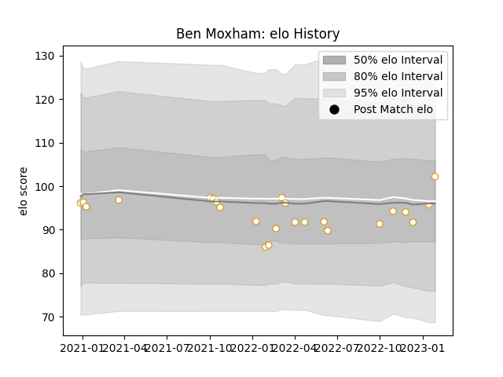

---  
layout: page  
title: Ben Moxham  
date: 2022-12-18 16:36:36.059679  
categories: player  
---
# Ben Moxham

## Positions: W, C

## Current elo: 97.0

## Current Percentile: 61.0

# Elo History

# Match History

| Team   |   Appearances |   Win Rate |
|:-------|--------------:|-----------:|
| Ulster |            22 |   0.636364 |

| Opponent         |   Matches |   Win Rate |
|:-----------------|----------:|-----------:|
| Munster          |         5 |   0.6      |
| Connacht         |         3 |   0.666667 |
| Leinster         |         3 |   0.333333 |
| Zebre            |         3 |   1        |
| Benetton Treviso |         1 |   1        |
| Bulls            |         1 |   0        |
| Cardiff Blues    |         1 |   1        |
| Dragons          |         1 |   1        |
| Lions            |         1 |   1        |
| Sale Sharks      |         1 |   0        |
| Scarlets         |         1 |   1        |
| Stormers         |         1 |   0        |