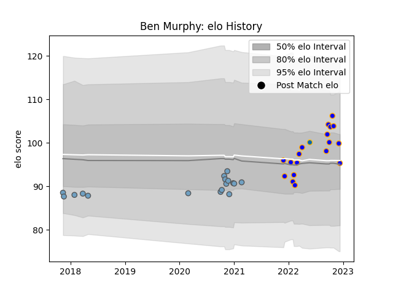

---  
layout: page  
title: Ben Murphy  
date: 2022-12-14 11:32:16.004075  
categories: player  
---
# Ben Murphy

## Positions: L

## Current elo: 95.0

## Current Percentile: 68.0

# Elo History

# Match History

| Team          |   Appearances |   Win Rate |
|:--------------|--------------:|-----------:|
| Doncaster     |            18 |   0.722222 |
| Cardiff Blues |            17 |   0.294118 |
| Leinster      |             1 |   1        |

| Opponent            |   Matches |   Win Rate |
|:--------------------|----------:|-----------:|
| Ospreys             |         3 |   0        |
| Ealing Trailfinders |         3 |   0.666667 |
| Ampthill            |         2 |   1        |
| Bedford             |         2 |   1        |
| Ulster              |         2 |   0.5      |
| Richmond            |         2 |   1        |
| Nottingham          |         2 |   0.5      |
| Munster             |         2 |   0.5      |
| Jersey              |         2 |   0.5      |
| Edinburgh           |         2 |   0        |
| Cornish Pirates     |         2 |   0.5      |
| Connacht            |         2 |   0.5      |
| Glasgow Warriors    |         1 |   0        |
| Hartpury College    |         1 |   1        |
| Leicester Tigers    |         1 |   0        |
| Leinster            |         1 |   0        |
| London Scottish     |         1 |   1        |
| Dragons             |         1 |   1        |
| Newcastle Falcons   |         1 |   0        |
| Coventry            |         1 |   0        |
| Benetton Treviso    |         1 |   1        |
| Zebre               |         1 |   1        |