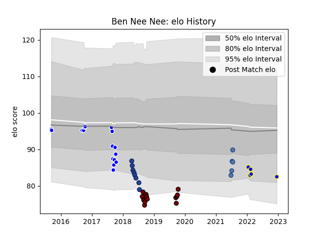

---  
layout: page  
title: Ben Nee Nee  
date: 2023-03-21 18:19:02.937001  
categories: player  
---
# Ben Nee Nee

Last updated: 2023-03-21
## Positions: L

## Country: Samoa

## Current elo: 75.0

## Current Percentile: 9.0

# Elo History

# Match History

| Team              |   Appearances |   Win Rate |
|:------------------|--------------:|-----------:|
| Auckland          |            17 |   0.470588 |
| North Harbour     |            14 |   0.5      |
| Kamaishi Seawaves |            11 |   0.363636 |
| Blues             |             8 |   0.125    |
| Samoa             |             6 |   0.5      |

| Opponent                 |   Matches |   Win Rate |
|:-------------------------|----------:|-----------:|
| Otago                    |         4 |   0.5      |
| Tasman                   |         4 |   0        |
| Tonga                    |         3 |   1        |
| Canterbury               |         3 |   0        |
| Bay of Plenty            |         3 |   1        |
| Taranaki                 |         3 |   0.333333 |
| Kurita Water Gush        |         2 |   1        |
| Northland                |         2 |   1        |
| New Zealand Maori        |         2 |   0        |
| Manawatu                 |         2 |   1        |
| Wellington               |         2 |   0.5      |
| Skyactivs Hiroshima      |         2 |   1        |
| Hurricanes               |         2 |   0        |
| Hino Red Dolphins        |         2 |   0        |
| Waikato                  |         2 |   0.5      |
| Hanazono Kintetsu Liners |         2 |   0        |
| Crusaders                |         2 |   0        |
| Counties Manukau         |         2 |   0.5      |
| United States of America |         1 |   0        |
| Sunwolves                |         1 |   1        |
| Southland                |         1 |   1        |
| Auckland                 |         1 |   0        |
| Shimizu Blue Sharks      |         1 |   0        |
| North Harbour            |         1 |   0        |
| Mie Honda Heat           |         1 |   0        |
| Melbourne Rebels         |         1 |   0        |
| Jaguares                 |         1 |   0        |
| Highlanders              |         1 |   0        |
| Hawke's Bay              |         1 |   1        |
| Mitsubishi Dynaboars     |         1 |   0        |