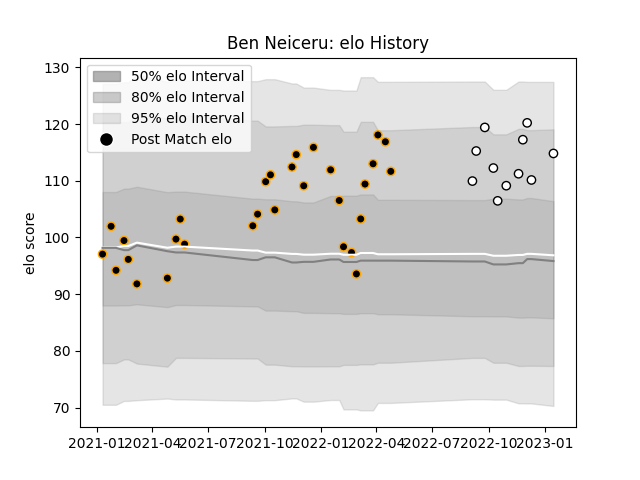

---  
layout: page  
title: Ben Neiceru  
date: 2022-12-09 13:13:20.729458  
categories: player  
---
# Ben Neiceru

## Positions: C

## Current elo: 101.0

## Current Percentile: 58.0

# Elo History

# Match History

| Team                       |   Appearances |   Win Rate |
|:---------------------------|--------------:|-----------:|
| Chambery                   |            26 |   0.442308 |
| Valence Romans Drome Rugby |             9 |   0.777778 |

| Opponent                   |   Matches |   Win Rate |
|:---------------------------|----------:|-----------:|
| Tarbes                     |         4 |   0.75     |
| Albi                       |         3 |   0        |
| Aubenas                    |         3 |   0.666667 |
| Dax                        |         3 |   0        |
| Nice                       |         3 |   0.666667 |
| Blagnac                    |         2 |   0.5      |
| Bourgoin-Jallieu           |         2 |   0.5      |
| Cognac Saint Jean d'Angély |         2 |   1        |
| Dijon                      |         2 |   1        |
| Massy                      |         2 |   0.25     |
| Suresnes                   |         2 |   1        |
| US Bressane                |         2 |   0        |
| Valence Romans Drome Rugby |         2 |   0        |
| Carqueiranne-Hyères        |         1 |   1        |
| Narbonne                   |         1 |   1        |
| Soyaux-Angouleme           |         1 |   1        |