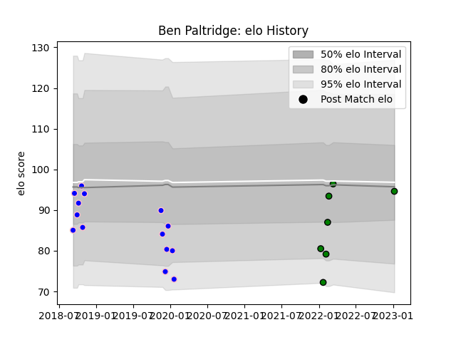

---  
layout: page  
title: Ben Paltridge  
date: 2023-01-13 11:27:45.070467  
categories: player  
---
# Ben Paltridge

## Positions: W

## Current elo: 95.0

## Current Percentile: 51.0

# Elo History

# Match History

| Team                 |   Appearances |   Win Rate |
|:---------------------|--------------:|-----------:|
| Kurita Water Gush    |            14 |   0.5      |
| Mitsubishi Dynaboars |             7 |   0.857143 |

| Opponent                         |   Matches |   Win Rate |
|:---------------------------------|----------:|-----------:|
| Hanazono Kintetsu Liners         |         4 |   0.5      |
| Kamaishi Seawaves                |         3 |   0.666667 |
| Kyuden Voltex                    |         2 |   1        |
| Mazda Blue Zoomers               |         2 |   1        |
| Chugoku Red Regulions            |         1 |   1        |
| Coca-Cola Red Sparks             |         1 |   0        |
| Hino Red Dolphins                |         1 |   1        |
| Mie Honda Heat                   |         1 |   1        |
| Mitsubishi Dynaboars             |         1 |   0        |
| NTT Docomo Red Hurricanes Osaka  |         1 |   0        |
| Saitama Wild Knights             |         1 |   0        |
| Shimizu Blue Sharks              |         1 |   1        |
| Skyactivs Hiroshima              |         1 |   1        |
| Toyota Industries Shuttles Aichi |         1 |   0        |