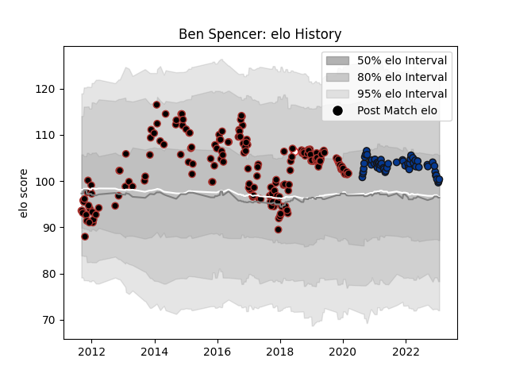

---  
layout: page  
title: Ben Spencer  
date: 2023-02-02 18:53:27.421514  
categories: player  
---
# Ben Spencer

## Positions: SH

## Country: England

## Current elo: 100.0

## Current Percentile: 60.0

# Elo History

# Match History

| Team       |   Appearances |   Win Rate |
|:-----------|--------------:|-----------:|
| Saracens   |           179 |   0.73743  |
| Bath Rugby |            56 |   0.383929 |
| England    |             5 |   0.3      |

| Opponent           |   Matches |   Win Rate |
|:-------------------|----------:|-----------:|
| Sale Sharks        |        23 |   0.608696 |
| Northampton Saints |        22 |   0.590909 |
| Exeter Chiefs      |        22 |   0.431818 |
| Wasps              |        18 |   0.555556 |
| Gloucester Rugby   |        18 |   0.583333 |
| Leicester Tigers   |        17 |   0.676471 |
| Harlequins         |        16 |   0.625    |
| Worcester Warriors |        15 |   0.8      |
| Newcastle Falcons  |        14 |   0.928571 |
| London Irish       |        10 |   0.9      |
| Bath Rugby         |        10 |   0.7      |
| Bristol Rugby      |         8 |   0.5      |
| Ospreys            |         5 |   0.9      |
| Glasgow Warriors   |         5 |   0.7      |
| Toulon             |         4 |   0.5      |
| Munster            |         4 |   0.75     |
| South Africa       |         4 |   0.25     |
| Scarlets           |         3 |   0.833333 |
| Clermont Auvergne  |         3 |   0.333333 |
| Cardiff Blues      |         3 |   1        |
| Racing 92          |         3 |   0.666667 |
| Biarritz Olympique |         2 |   0.5      |
| Leinster           |         2 |   0.5      |
| Saracens           |         2 |   0.25     |
| Benetton Treviso   |         2 |   1        |
| Lyon               |         2 |   1        |
| Scotland           |         1 |   0.5      |
| Stade Toulousain   |         1 |   1        |
| London Welsh       |         1 |   1        |