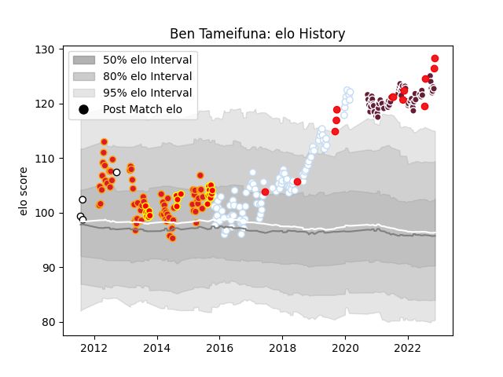

---  
layout: page  
title: Ben Tameifuna  
date: 2023-02-02 18:58:57.377099  
categories: player  
---
# Ben Tameifuna

## Positions: P

## Country: Tonga

## Current elo: 143.0

## Current Percentile: 99.0

# Elo History

# Match History

| Team            |   Appearances |   Win Rate |
|:----------------|--------------:|-----------:|
| Racing 92       |           106 |   0.683962 |
| Chiefs          |            65 |   0.661538 |
| Bordeaux Begles |            63 |   0.579365 |
| Waikato         |            20 |   0.45     |
| Tonga           |            14 |   0.214286 |
| Hawke's Bay     |             4 |   0.5      |

| Opponent                 |   Matches |   Win Rate |
|:-------------------------|----------:|-----------:|
| Castres Olympique        |        15 |   0.566667 |
| Clermont Auvergne        |        15 |   0.633333 |
| Stade Toulousain         |        13 |   0.538462 |
| Montpellier Herault      |        13 |   0.692308 |
| Stade Francais Paris     |        12 |   0.666667 |
| Crusaders                |        10 |   0.7      |
| Pau                      |        10 |   0.55     |
| La Rochelle              |        10 |   0.4      |
| Lyon                     |         9 |   0.555556 |
| Toulon                   |         9 |   0.777778 |
| Brive                    |         9 |   0.888889 |
| Hurricanes               |         8 |   0.5      |
| Highlanders              |         8 |   0.5      |
| Blues                    |         7 |   1        |
| Racing 92                |         6 |   0.666667 |
| Leicester Tigers         |         6 |   0.666667 |
| Agen                     |         6 |   1        |
| Sharks                   |         5 |   0.6      |
| Perpignan                |         5 |   0.6      |
| Bordeaux Begles          |         5 |   0.8      |
| Brumbies                 |         5 |   0.6      |
| Western Force            |         4 |   0.75     |
| Bayonne                  |         4 |   0.75     |
| Cheetahs                 |         4 |   0.875    |
| Samoa                    |         4 |   0        |
| Munster                  |         4 |   0.5      |
| Melbourne Rebels         |         3 |   0.666667 |
| Stormers                 |         3 |   0.666667 |
| Bay of Plenty            |         3 |   1        |
| Southland                |         3 |   0.333333 |
| Scarlets                 |         3 |   1        |
| New South Wales Waratahs |         3 |   0.333333 |
| Counties Manukau         |         3 |   0.333333 |
| Grenoble                 |         3 |   0.666667 |
| Canterbury               |         3 |   0        |
| Bulls                    |         2 |   0.75     |
| Oyonnax                  |         2 |   1        |
| England                  |         2 |   0        |
| Taranaki                 |         2 |   0.5      |
| Queensland Reds          |         2 |   0        |
| Fiji                     |         2 |   0.5      |
| Glasgow Warriors         |         2 |   0.5      |
| Northampton Saints       |         2 |   0.75     |
| North Harbour            |         2 |   1        |
| Lions                    |         2 |   1        |
| Wellington               |         2 |   0.5      |
| Uruguay                  |         1 |   1        |
| Wales                    |         1 |   0        |
| Ulster                   |         1 |   0        |
| Auckland                 |         1 |   0        |
| Tasman                   |         1 |   0        |
| Manawatu                 |         1 |   1        |
| Saracens                 |         1 |   0        |
| Georgia                  |         1 |   0        |
| Hawke's Bay              |         1 |   1        |
| Bristol Rugby            |         1 |   0        |
| Hong Kong                |         1 |   1        |
| Romania                  |         1 |   0        |
| Biarritz Olympique       |         1 |   1        |
| Edinburgh                |         1 |   1        |
| Northland                |         1 |   0        |
| Argentina                |         1 |   0        |
| Otago                    |         1 |   0        |