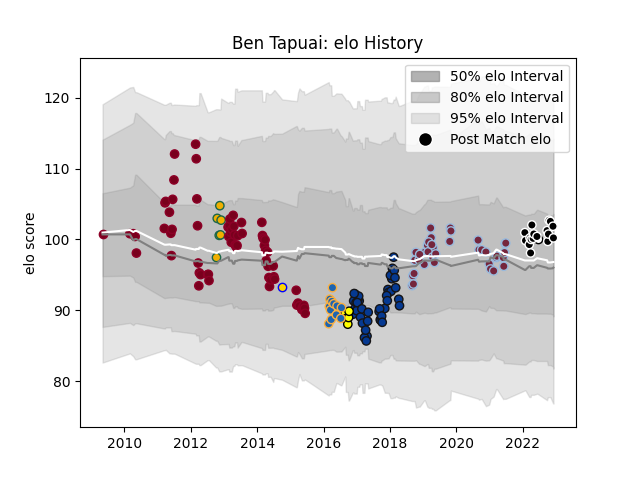

---  
layout: page  
title: Ben Tapuai  
date: 2023-02-02 18:41:02.015262  
categories: player  
---
# Ben Tapuai

## Positions: C

## Country: Australia

## Current elo: 109.0

## Current Percentile: 79.0

# Elo History

# Match History

| Team            |   Appearances |   Win Rate |
|:----------------|--------------:|-----------:|
| Queensland Reds |            69 |  0.521739  |
| Bath Rugby      |            43 |  0.5       |
| Harlequins      |            38 |  0.513158  |
| Sharks          |            23 |  0.717391  |
| Western Force   |            12 |  0.0833333 |
| Australia       |             7 |  0.785714  |
| Perth Spirit    |             7 |  0.714286  |
| Brisbane City   |             2 |  0         |
| Natal Sharks    |             1 |  0         |

| Opponent                 |   Matches |   Win Rate |
|:-------------------------|----------:|-----------:|
| Brumbies                 |        10 |   0.25     |
| New South Wales Waratahs |         9 |   0.444444 |
| Melbourne Rebels         |         9 |   0.666667 |
| Western Force            |         8 |   0.4375   |
| Bristol Rugby            |         8 |   0.625    |
| Lions                    |         7 |   0.714286 |
| Worcester Warriors       |         7 |   0.571429 |
| Newcastle Falcons        |         7 |   0.428571 |
| Leicester Tigers         |         7 |   0.714286 |
| Crusaders                |         7 |   0.285714 |
| Northampton Saints       |         6 |   0.333333 |
| Exeter Chiefs            |         6 |   0.166667 |
| Sharks                   |         5 |   0.2      |
| Sale Sharks              |         5 |   0.4      |
| Saracens                 |         5 |   0.4      |
| Highlanders              |         5 |   0.8      |
| Stormers                 |         5 |   0.3      |
| Chiefs                   |         5 |   0.6      |
| Harlequins               |         5 |   0.4      |
| Bulls                    |         5 |   0.2      |
| Blues                    |         5 |   0.6      |
| Wasps                    |         4 |   0.25     |
| Gloucester Rugby         |         4 |   0.875    |
| Bath Rugby               |         4 |   0.5      |
| Hurricanes               |         3 |   0.333333 |
| Cardiff Blues            |         3 |   0.333333 |
| Cheetahs                 |         3 |   0.666667 |
| Agen                     |         2 |   1        |
| Melbourne Rising         |         2 |   0.5      |
| Scarlets                 |         2 |   0.5      |
| Toulon                   |         2 |   0.5      |
| Wales                    |         2 |   1        |
| London Irish             |         2 |   0.75     |
| Zebre                    |         2 |   1        |
| Leinster                 |         2 |   0.5      |
| Edinburgh                |         2 |   0.5      |
| Greater Sydney Rams      |         2 |   0.5      |
| Bordeaux Begles          |         2 |   1        |
| Dragons                  |         2 |   1        |
| Benetton Treviso         |         1 |   1        |
| Western Province         |         1 |   0        |
| Brisbane City            |         1 |   1        |
| Brive                    |         1 |   1        |
| Canberra Vikings         |         1 |   1        |
| Clermont Auvergne        |         1 |   0        |
| Stade Francais Paris     |         1 |   0        |
| Connacht                 |         1 |   1        |
| England                  |         1 |   1        |
| Argentina                |         1 |   1        |
| Queensland Reds          |         1 |   1        |
| Queensland Country       |         1 |   1        |
| Pau                      |         1 |   1        |
| Ospreys                  |         1 |   1        |
| France                   |         1 |   0        |
| North Harbour Rays       |         1 |   0        |
| Glasgow Warriors         |         1 |   1        |
| New Zealand              |         1 |   0.5      |
| NSW Country Eagles       |         1 |   0        |
| Grenoble                 |         1 |   1        |
| Italy                    |         1 |   1        |