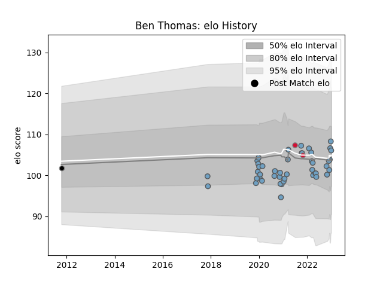

---  
layout: page  
title: Ben Thomas  
date: 2023-02-02 18:45:11.110394  
categories: player  
---
# Ben Thomas

## Positions: C, FB

## Country: Wales

## Current elo: 102.0

## Current Percentile: 67.0

# Elo History

# Match History

| Team          |   Appearances |   Win Rate |
|:--------------|--------------:|-----------:|
| Cardiff Blues |            49 |   0.510204 |
| Wales         |             2 |   0.5      |
| Ospreys       |             1 |   0        |

| Opponent          |   Matches |   Win Rate |
|:------------------|----------:|-----------:|
| Scarlets          |         6 |   0.333333 |
| Benetton Treviso  |         5 |   0.8      |
| Ospreys           |         5 |   0.4      |
| Newcastle Falcons |         4 |   0.75     |
| Dragons           |         3 |   1        |
| Edinburgh         |         3 |   0.333333 |
| Leinster          |         3 |   0.333333 |
| Glasgow Warriors  |         2 |   0.5      |
| Brive             |         2 |   0.5      |
| Calvisano         |         2 |   1        |
| Pau               |         2 |   0.5      |
| Bulls             |         2 |   0        |
| Sharks            |         2 |   1        |
| Stormers          |         2 |   0.5      |
| Connacht          |         1 |   0        |
| Exeter Chiefs     |         1 |   0        |
| Leicester Tigers  |         1 |   0        |
| Lions             |         1 |   0        |
| Munster           |         1 |   0        |
| New Zealand       |         1 |   0        |
| Canada            |         1 |   1        |
| Ulster            |         1 |   0        |
| Zebre             |         1 |   1        |