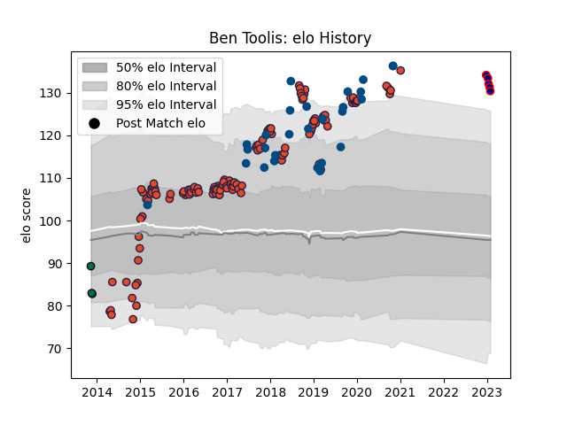

---  
layout: page  
title: Ben Toolis  
date: 2022-12-28 12:52:37.026561  
categories: player  
---
# Ben Toolis

## Positions: L

## Country: Scotland

## Current elo: 123.0

## Current Percentile: None

# Elo History

# Match History

| Team                     |   Appearances |   Win Rate |
|:-------------------------|--------------:|-----------:|
| Edinburgh                |           126 |   0.551587 |
| Scotland                 |            28 |   0.517857 |
| London Irish             |             2 |   0        |
| Hanazono Kintetsu Liners |             1 |   0        |

| Opponent                 |   Matches |   Win Rate |
|:-------------------------|----------:|-----------:|
| Glasgow Warriors         |        16 |   0.625    |
| Munster                  |        11 |   0.272727 |
| Dragons                  |         9 |   0.666667 |
| Leinster                 |         9 |   0.222222 |
| Benetton Treviso         |         8 |   0.75     |
| Ulster                   |         8 |   0.125    |
| Scarlets                 |         8 |   0.625    |
| Zebre                    |         7 |   0.571429 |
| Connacht                 |         6 |   0.5      |
| Cardiff Blues            |         5 |   0.4      |
| Ospreys                  |         5 |   0        |
| Italy                    |         4 |   0.75     |
| Wales                    |         4 |   0.25     |
| Southern Kings           |         4 |   1        |
| Stade Francais Paris     |         3 |   0.666667 |
| Newcastle Falcons        |         3 |   0.666667 |
| London Irish             |         3 |   1        |
| France                   |         3 |   0.333333 |
| Bordeaux Begles          |         3 |   0.5      |
| Georgia                  |         3 |   1        |
| Harlequins               |         2 |   1        |
| Wasps                    |         2 |   1        |
| Australia                |         2 |   1        |
| Toulon                   |         2 |   1        |
| Timisoara Saracens       |         2 |   1        |
| England                  |         2 |   0.25     |
| Ireland                  |         2 |   0        |
| Agen                     |         2 |   1        |
| Montpellier Herault      |         2 |   0.5      |
| Lyon                     |         2 |   0.5      |
| London Welsh             |         2 |   1        |
| New Zealand              |         1 |   0        |
| Northampton Saints       |         1 |   0        |
| Russia                   |         1 |   1        |
| Samoa                    |         1 |   1        |
| South Africa             |         1 |   0        |
| Cheetahs                 |         1 |   1        |
| Canada                   |         1 |   1        |
| Argentina                |         1 |   1        |
| Gloucester Rugby         |         1 |   0        |
| United States of America |         1 |   0        |
| Kobelco Kobe Steelers    |         1 |   0        |
| Grenoble                 |         1 |   0        |
| Fiji                     |         1 |   0        |