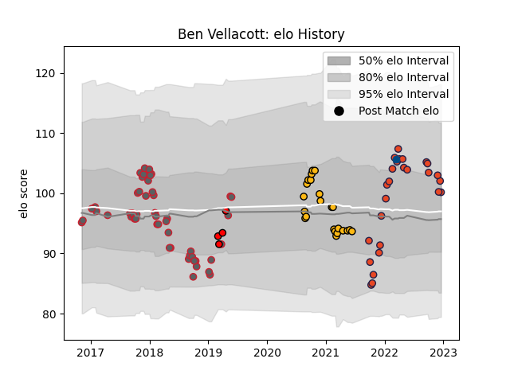

---  
layout: page  
title: Ben Vellacott  
date: 2022-12-09 13:15:45.183996  
categories: player  
---
# Ben Vellacott

## Positions: SH

## Country: Scotland

## Current elo: 100.0

## Current Percentile: 75.0

# Elo History

# Match History

| Team             |   Appearances |   Win Rate |
|:-----------------|--------------:|-----------:|
| Gloucester Rugby |            51 |   0.539216 |
| Edinburgh        |            24 |   0.520833 |
| Wasps            |            23 |   0.521739 |
| Hartpury College |             4 |   0.75     |
| Scotland         |             1 |   1        |

| Opponent            |   Matches |   Win Rate |
|:--------------------|----------:|-----------:|
| Northampton Saints  |         7 |   0.428571 |
| Saracens            |         7 |   0.571429 |
| Worcester Warriors  |         6 |   0.833333 |
| Leicester Tigers    |         6 |   0.166667 |
| Bath Rugby          |         5 |   0.6      |
| Bristol Rugby       |         5 |   0.8      |
| Sale Sharks         |         5 |   0.4      |
| Newcastle Falcons   |         5 |   0.8      |
| Zebre               |         4 |   1        |
| Wasps               |         4 |   0.625    |
| Munster             |         4 |   0        |
| Exeter Chiefs       |         4 |   0.5      |
| Harlequins          |         4 |   0.5      |
| Dragons             |         3 |   1        |
| Benetton Treviso    |         3 |   0.333333 |
| London Irish        |         3 |   0.333333 |
| Ospreys             |         2 |   0.5      |
| Pau                 |         2 |   0        |
| Stormers            |         2 |   0.25     |
| Agen                |         2 |   1        |
| Gloucester Rugby    |         2 |   0        |
| Glasgow Warriors    |         2 |   0.5      |
| Castres Olympique   |         2 |   0.5      |
| Cardiff Blues       |         2 |   0.5      |
| Bulls               |         2 |   0.5      |
| London Scottish     |         1 |   1        |
| Italy               |         1 |   1        |
| Nottingham          |         1 |   1        |
| Ealing Trailfinders |         1 |   0        |
| Connacht            |         1 |   1        |
| Scarlets            |         1 |   1        |
| Sharks              |         1 |   1        |
| Ulster              |         1 |   0        |
| Bedford             |         1 |   1        |
| Lions               |         1 |   0        |