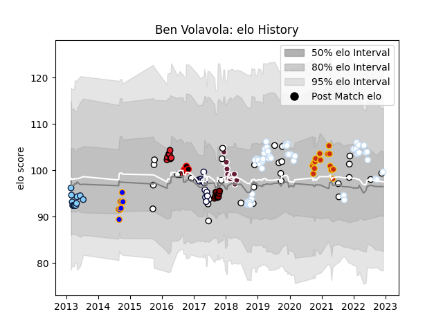

---  
layout: page  
title: Ben Volavola  
date: 2022-11-15 23:36:17.312579  
categories: player  
---
# Ben Volavola

## Positions: FH, FB

## Country: Fiji

## Current elo: 97.0

## Current Percentile: 47.0

# Elo History

# Match History

| Team                     |   Appearances |   Win Rate |
|:-------------------------|--------------:|-----------:|
| Racing 92                |            55 |   0.618182 |
| Fiji                     |            29 |   0.396552 |
| Bordeaux Begles          |            16 |   0.375    |
| Perpignan                |            15 |   0.9      |
| Melbourne Rebels         |            13 |   0.115385 |
| Canterbury               |            12 |   0.833333 |
| New South Wales Waratahs |            12 |   0.5      |
| North Harbour            |            10 |   0.7      |
| Crusaders                |             8 |   0.75     |
| Greater Sydney Rams      |             2 |   0        |

| Opponent                   |   Matches |   Win Rate |
|:---------------------------|----------:|-----------:|
| Stade Toulousain           |         7 |   0.285714 |
| La Rochelle                |         6 |   0.666667 |
| Pau                        |         6 |   0.666667 |
| Stade Francais Paris       |         5 |   0.6      |
| Lyon                       |         4 |   0.25     |
| Bordeaux Begles            |         4 |   0.5      |
| Montpellier Herault        |         4 |   0.5      |
| Castres Olympique          |         4 |   0.5      |
| Lions                      |         3 |   0.333333 |
| Queensland Reds            |         3 |   0        |
| Grenoble                   |         3 |   1        |
| Georgia                    |         3 |   0.5      |
| Southern Kings             |         3 |   0.666667 |
| Counties Manukau           |         3 |   0.666667 |
| Clermont Auvergne          |         3 |   0.166667 |
| Chiefs                     |         3 |   0.333333 |
| Western Force              |         3 |   1        |
| Blues                      |         3 |   0.666667 |
| Toulon                     |         3 |   0.666667 |
| Wales                      |         3 |   0        |
| Australia                  |         3 |   0        |
| Brumbies                   |         3 |   0.333333 |
| Uruguay                    |         3 |   0.666667 |
| Tasman                     |         3 |   0.666667 |
| Biarritz Olympique         |         3 |   0.666667 |
| Ospreys                    |         2 |   1        |
| Nevers                     |         2 |   1        |
| New South Wales Waratahs   |         2 |   0        |
| New Zealand                |         2 |   0        |
| Waikato                    |         2 |   1        |
| Northland                  |         2 |   1        |
| Taranaki                   |         2 |   1        |
| Perpignan                  |         2 |   0.5      |
| Rouen                      |         2 |   0.5      |
| Scarlets                   |         2 |   1        |
| Scotland                   |         2 |   0.5      |
| Sharks                     |         2 |   0.75     |
| Ulster                     |         2 |   0.5      |
| Tonga                      |         2 |   0.5      |
| Munster                    |         2 |   0.75     |
| Agen                       |         2 |   1        |
| Auckland                   |         2 |   1        |
| Brive                      |         2 |   0.5      |
| Dragons                    |         2 |   0.5      |
| Hurricanes                 |         2 |   0        |
| Ireland                    |         2 |   0        |
| Italy                      |         2 |   0.5      |
| Canterbury                 |         2 |   0        |
| Leicester Tigers           |         2 |   1        |
| Hawke's Bay                |         2 |   1        |
| Valence Romans Drome Rugby |         1 |   1        |
| Bulls                      |         1 |   0        |
| Canada                     |         1 |   1        |
| Canberra Vikings           |         1 |   0        |
| England                    |         1 |   0        |
| Vannes                     |         1 |   1        |
| Carcassonne                |         1 |   1        |
| Cheetahs                   |         1 |   0        |
| Bayonne                    |         1 |   0        |
| Crusaders                  |         1 |   0        |
| Spain                      |         1 |   1        |
| Southland                  |         1 |   1        |
| Aurillac                   |         1 |   0.5      |
| Saracens                   |         1 |   1        |
| France                     |         1 |   1        |
| Jaguares                   |         1 |   1        |
| Melbourne Rebels           |         1 |   1        |
| Manawatu                   |         1 |   0        |
| New Zealand Maori          |         1 |   1        |
| Newcastle Falcons          |         1 |   0        |
| North Harbour              |         1 |   1        |
| Japan                      |         1 |   1        |
| Otago                      |         1 |   1        |
| Mont-de-Marsan             |         1 |   1        |
| Oyonnax                    |         1 |   1        |
| Provence Rugby             |         1 |   1        |
| Queensland Country         |         1 |   0        |
| RC Enisei                  |         1 |   1        |
| Highlanders                |         1 |   0        |
| Samoa                      |         1 |   0        |
| Montauban                  |         1 |   1        |