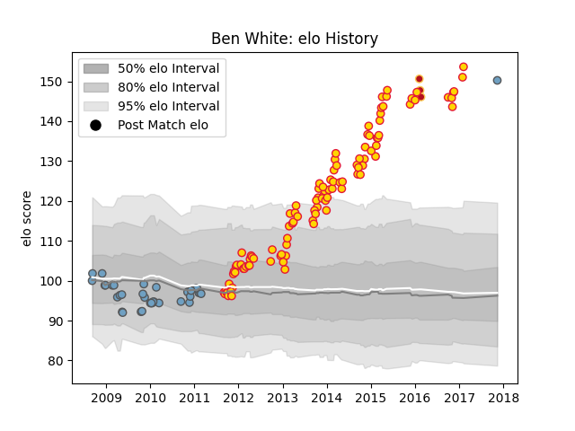

---  
layout: page  
title: Ben White  
date: 2022-11-15 23:42:39.067405  
categories: player  
---
# Ben White

## Positions: FL

## Current elo: 151.0

## Current Percentile: None

# Elo History

# Match History

| Team          |   Appearances |   Win Rate |
|:--------------|--------------:|-----------:|
| Exeter Chiefs |           106 |   0.59434  |
| Cardiff Blues |            35 |   0.442857 |
| Dragons       |             3 |   0        |

| Opponent             |   Matches |   Win Rate |
|:---------------------|----------:|-----------:|
| Bath Rugby           |        10 |   0.3      |
| Northampton Saints   |        10 |   0.4      |
| Harlequins           |        10 |   0.5      |
| Gloucester Rugby     |         9 |   0.555556 |
| Saracens             |         9 |   0.222222 |
| Sale Sharks          |         9 |   0.555556 |
| Newcastle Falcons    |         9 |   0.777778 |
| Wasps                |         8 |   0.875    |
| Leicester Tigers     |         8 |   0.375    |
| London Irish         |         5 |   0.8      |
| Leinster             |         5 |   0.3      |
| Glasgow Warriors     |         5 |   0.6      |
| Worcester Warriors   |         5 |   1        |
| Ospreys              |         4 |   0.5      |
| Ulster               |         4 |   0.25     |
| Edinburgh            |         4 |   0.25     |
| Cardiff Blues        |         3 |   1        |
| Connacht             |         3 |   0.666667 |
| London Welsh         |         3 |   1        |
| Scarlets             |         3 |   0.333333 |
| Dragons              |         3 |   1        |
| Bordeaux Begles      |         2 |   0.5      |
| Toulon               |         2 |   0        |
| La Rochelle          |         2 |   1        |
| Munster              |         2 |   0.5      |
| Perpignan            |         2 |   0.5      |
| Bristol Rugby        |         1 |   1        |
| Castres Olympique    |         1 |   1        |
| Stade Francais Paris |         1 |   0        |
| Cavalieri Prato      |         1 |   1        |
| Benetton Treviso     |         1 |   0        |